# Developer Guide

---

## Acknowledgements

{list here sources of all reused/adapted ideas, code, documentation, and third-party libraries -- include links to the original source as well}

---

## Design & implementation

### Interactive Mode Architecture

The interactive mode is a conversational interface that guides users through command execution when they provide incomplete or no arguments. It transforms single-word commands like "add" or "mark" into step-by-step guided experiences with validation, error handling, and clear navigation options.

#### Core Components

The interactive mode consists of three main components:

1. **CommandHandler** - Detects when interactive mode should be triggered
2. **InteractivePromptHandler** - Manages all interactive prompting logic
3. **Task Status Display** - Visual indicators for task completion state

#### Architecture Diagram

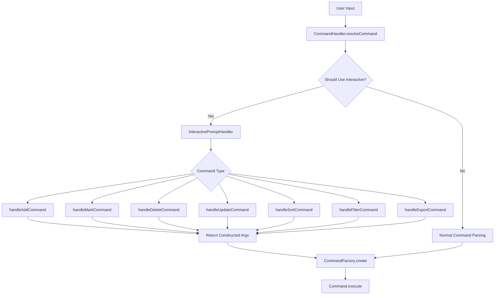

### Interactive Mode Detection

The `CommandHandler.shouldUseInteractiveMode()` method determines when to trigger interactive mode based on command type and argument completeness:

```java
private boolean shouldUseInteractiveMode(CommandParser.ParsedCommand parsed) {
    switch (parsed.getType()) {
    case ADD_TASK:
        return parsed.getArguments().trim().isEmpty();
    case CREATE_PROJECT:
        return parsed.getArguments().trim().isEmpty();
    // ... other cases
    default:
        return false;
    }
}
```

**Decision Rationale**: Interactive mode is triggered only for main commands with empty arguments, preserving backward compatibility with existing CLI syntax.

### InteractivePromptHandler Class Design

The `InteractivePromptHandler` class encapsulates all interactive prompting logic with the following design principles:

- **Single Responsibility**: Each `handleXCommand()` method manages one specific interactive flow
- **Dependency Injection**: Constructor receives `ProjectList` and `Scanner` for testability
- **Tsundere Personality**: All prompts use indirect, teasing language ("Hmph", "Don't keep me waiting!")
- **Consistent Error Handling**: Specific validation with clear error messages and re-prompting
- **Exit Navigation**: All prompts include "press 'enter' to exit" options

#### Class Diagram: InteractivePromptHandler Structure

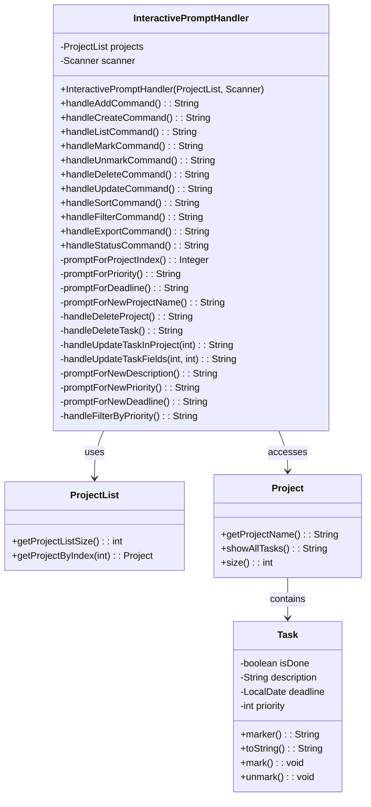

### Task Status Display System

Tasks display completion status using visual markers integrated into the `Task.toString()` method:

```java
public String marker() {
    return isDone ? "[X]" : "[ ]";
}

public String toString() {
    StringBuilder sb = new StringBuilder();
    sb.append(marker()).append(" ").append(description);
    // ... add deadline and priority info
    return sb.toString();
}
```

**Display Example**:
```
1. [X] Implement login feature (Due: Dec 31, 2024) [high]
2. [ ] Write unit tests [medium]
3. [ ] Fix bug in parser [low]
```

### Interactive Command Flows

#### Add Command Flow

The add command guides users through project selection, task description, priority, and optional deadline:

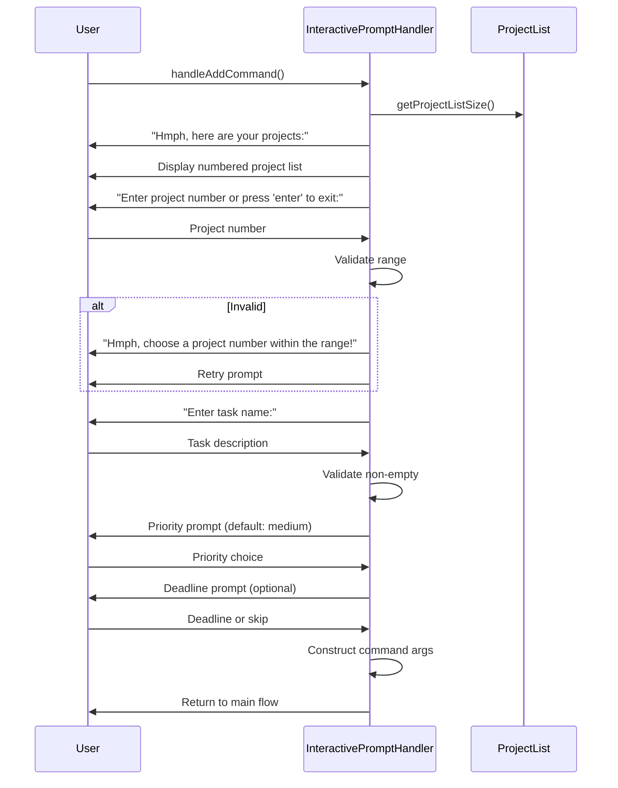

**Key Features**:
- Project validation with range checking
- Required task description with empty string rejection
- Optional priority (defaults to "medium")
- Optional deadline with YYYY-MM-DD format validation

#### Add Command State Flow

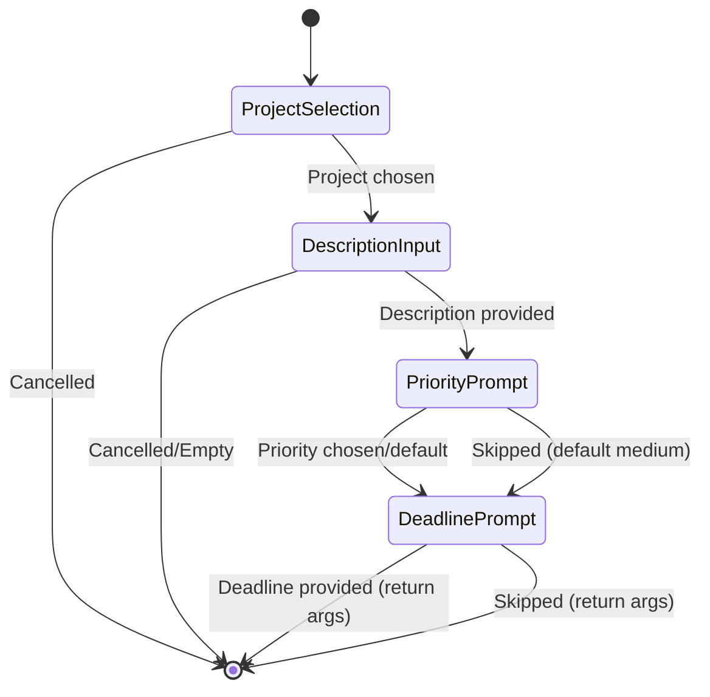

**Optional Fields**: Priority and deadline can be skipped, defaulting to "medium" and no deadline respectively.

#### Mark/Unmark Command Flows

Mark and unmark commands share similar logic but with different validation:

```java
public String handleMarkCommand() {
    Integer projectSelection = promptForProjectIndex();
    if (projectSelection == null) return null;

    // Display tasks with status markers
    System.out.println("Hmph, which tasks do you want to mark as done in " + projectName + ":");
    for (int i = 0; i < project.size(); i++) {
        var task = project.getProjectTasks().get(i);
        String status = task.isDone() ? "x" : " ";
        System.out.println((i + 1) + ". [" + status + "] " + task.getDescription());
    }

    // Multiple task selection with comma separation
    String input = scanner.nextLine().trim();
    String[] indices = input.split(",");
    // ... validation and construction
}
```

**Mark vs Unmark Validation**:
- **Mark**: Prevents marking already completed tasks
- **Unmark**: Prevents unmarking already incomplete tasks
- **Error Message**: "Your task is not even marked, what do you want me to unmark!"

#### Delete Command Flow

Delete command uses a two-stage approach: type selection then specific item selection with confirmation:

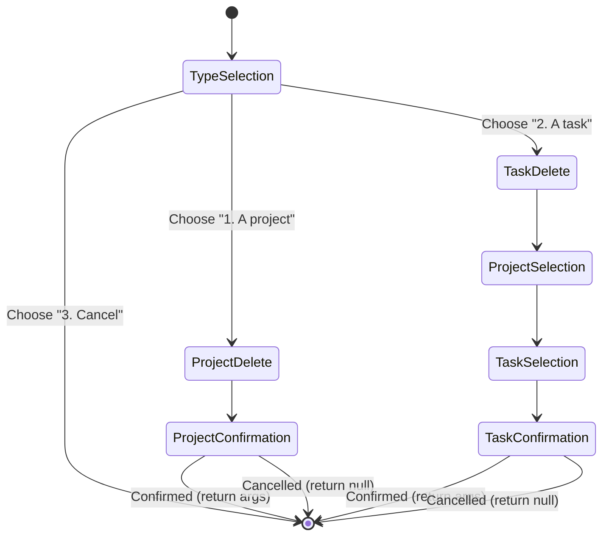

**Safety Features**:
- Confirmation prompts for all destructive operations
- Clear project/task listing before selection
- Case-insensitive confirmation ("y", "yes", "n", "no")

#### Update Command Flow

Update command implements recursive field updates allowing multiple changes in one session:

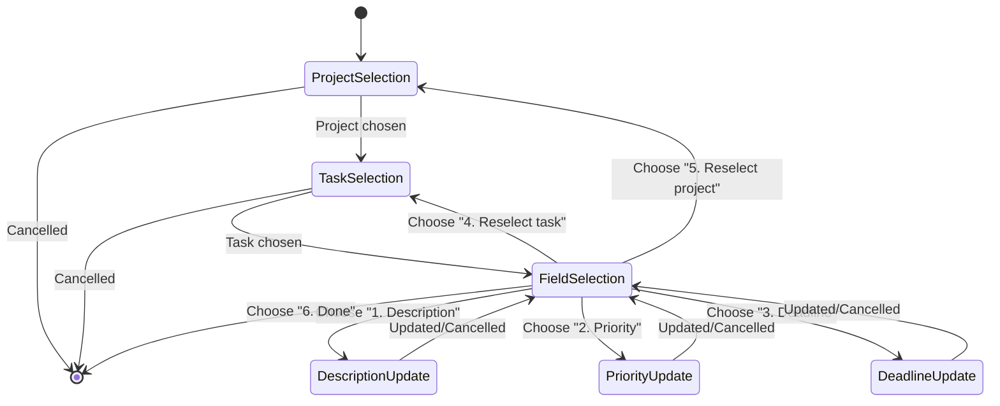

**Recursive Design**: Users can update multiple fields without restarting the flow, with options to reselect tasks/projects or exit at any point.

#### Export Command Flow

Export command offers multiple export options with filtering and sorting:

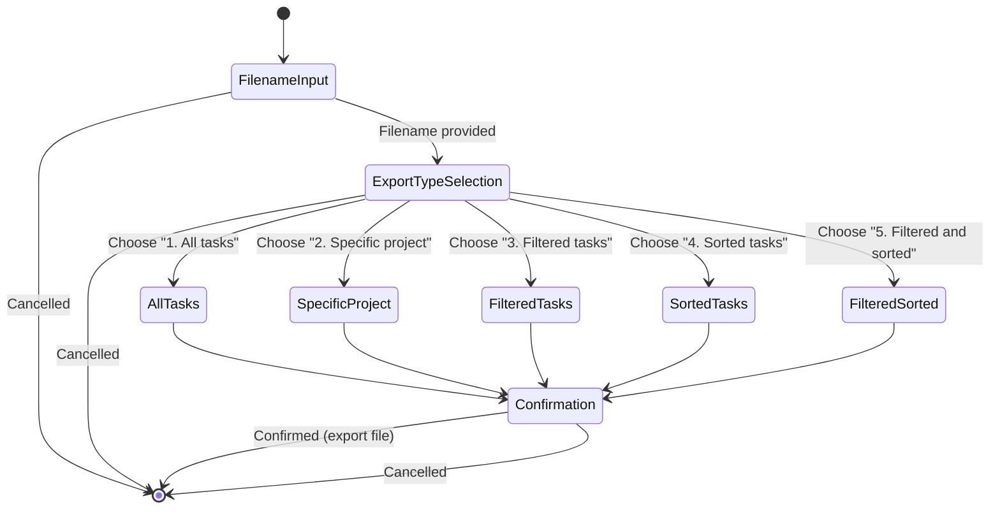

**Complex Options**: Supports all combinations of project selection, filtering, and sorting with final confirmation.

#### Create Command Flow

Create command prompts for a new project name with validation:

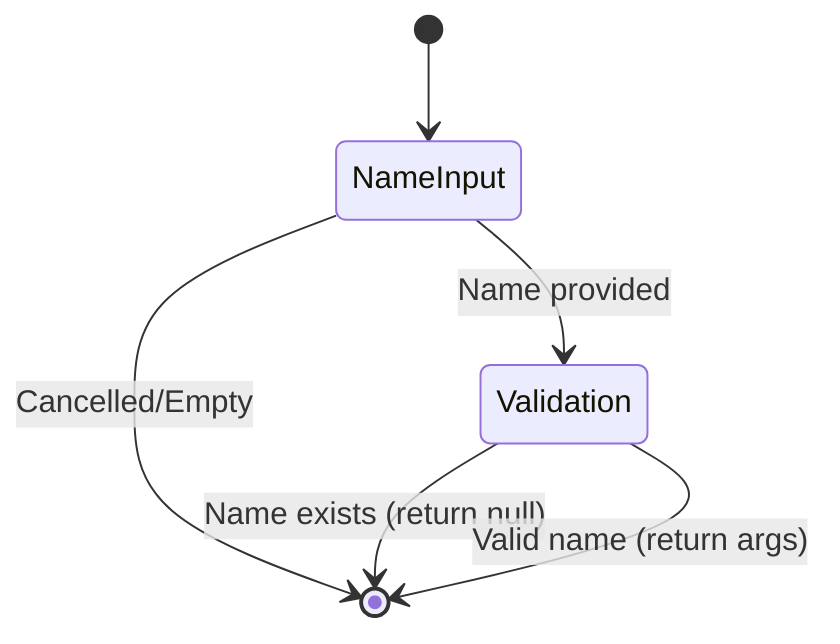

**Validation**: Checks for empty names and duplicate project names.

#### Mark/Unmark Command Flows

Mark and unmark commands follow identical selection flow with different validation:

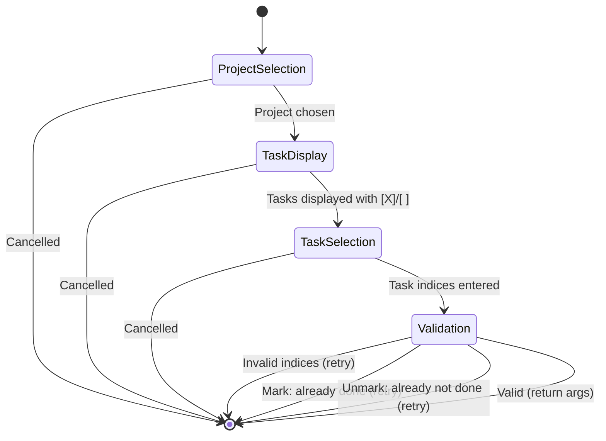

**Shared Logic**: Both commands use identical project/task selection but different validation rules.

#### Sort Command Flow

Sort command offers field and order selection:

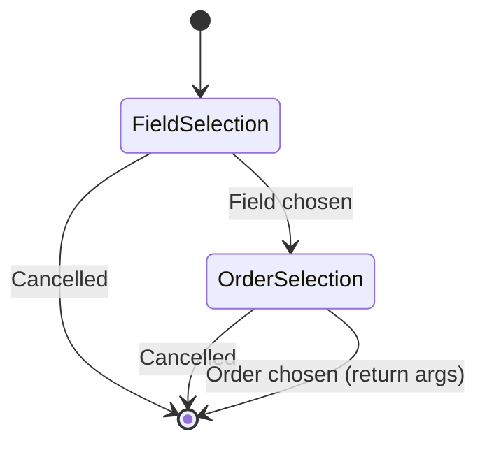

**Simple Flow**: Two sequential choices with no complex validation.

#### Filter Command Flow

Filter command offers priority level selection:

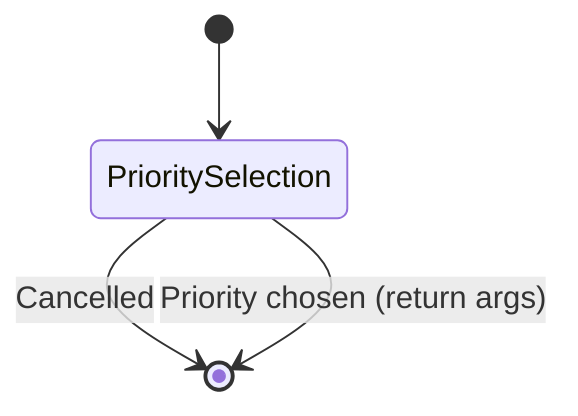

**Single Choice**: Simple selection from three priority options.

### Validation and Error Handling

#### Input Validation Layers

1. **Presence Validation**: Check for empty/null inputs
2. **Format Validation**: Verify correct formats (dates, numbers)
3. **Range Validation**: Ensure indices within valid bounds
4. **Business Logic Validation**: Prevent invalid state transitions

#### Error Message Patterns

All error messages follow consistent patterns with tsundere personality:

- **Range Errors**: "Hmph, choose a task number within the range!"
- **Format Errors**: "Invalid date format. Use YYYY-MM-DD."
- **Logic Errors**: "Your task is not even marked, what do you want me to unmark!"
- **Required Field Errors**: "Task name cannot be empty. I sent you back to main page!"

#### Exit Navigation

Every prompt includes exit options:
```java
System.out.print("Enter project number to delete, or press 'enter' to exit: ");
String input = scanner.nextLine().trim();
if (input.isEmpty()) {
    return null; // Cancelled
}
```

### Design Considerations

#### Personality Integration

**Decision**: Tsundere personality throughout prompts
- **Pros**: Creates distinctive, memorable user experience
- **Cons**: May not suit all user preferences
- **Rationale**: Differentiates FlowCLI from generic CLI tools, adds character to interactions

#### Exit Options Everywhere

**Decision**: Include "press enter to exit" in all prompts
- **Pros**: Provides escape hatch, prevents user frustration
- **Cons**: Slightly more verbose prompts
- **Rationale**: Better user experience, allows graceful cancellation at any step

#### Status Display Format

**Decision**: Use `[X]` and `[ ]` markers
- **Pros**: Universally understood, clear visual indicators
- **Cons**: Limited to two states
- **Rationale**: Simple, effective, matches common task management conventions

#### Single Handler Class

**Decision**: One class handling all interactive prompts
- **Pros**: Centralized logic, consistent behavior, easier maintenance
- **Cons**: Large class (1000+ lines)
- **Rationale**: Related functionality stays together, easier to ensure consistency

### Testing Approach

Interactive mode is tested through:
- **Unit Tests**: Individual handler methods with mocked inputs
- **Integration Tests**: End-to-end command flows
- **UI Tests**: `EXPECTED.TXT` updated to match interactive output
- **Edge Case Coverage**: Empty projects, invalid inputs, cancellation flows

### Future Enhancements

- **Tab Completion**: Auto-complete for project/task names
- **Command History**: Navigate through previous interactive sessions
- **Bulk Operations**: Select multiple items with ranges ("1-5,7,9-11")
- **Custom Prompts**: User-configurable personality settings
- **Progress Indicators**: Show completion progress during multi-step operations

### Core Functionality

Task Management: Add, update, and delete tasks.

Project Management: Create new projects.

### Data Processing

Sorting: Implement algorithms to sort tasks or projects.

Filtering: Implement algorithms to filter tasks or projects.

### Data Persistence

Export: Export current project and task data to a file.

### User Interface

Interactive Mode: A command-line interface for continuous user input.

Help Command: Provides a utility to display usage instructions.

---

## Product scope

---

### Target user profile

{Describe the target user profile}

---

### Value proposition

{Describe the value proposition: what problem does it solve?}

---

## User Stories

| Version | As a ... | I want to ...             | So that I can ...                                           |
| ------- | -------- | ------------------------- | ----------------------------------------------------------- |
| v1.0    | new user | see usage instructions    | refer to them when I forget how to use the application      |
| v2.0    | user     | find a to-do item by name | locate a to-do without having to go through the entire list |

---

## Non-Functional Requirements

{Give non-functional requirements}

---

## Glossary

* *glossary item* - Definition
* dfsdf
*

---

## Instructions for manual testing

{Give instructions on how to do a manual product testing e.g., how to load sample data to be used for testing}
