# Developer Guide

---

## Acknowledgements

{list here sources of all reused/adapted ideas, code, documentation, and third-party libraries -- include links to the original source as well}

---

## Table of Contents

- [Architecture](#architecture-yao-xiang)
- [Implementation &amp; Design](#implementation--design)
  - [Core Functionality](#core-functionality)
  - [Data Processing](#data-processing)
  - [Data Persistence](#data-persistence)
  - [User Interface](#user-interface)
    - [Interactive Mode](#interactive-mode-yao-xiang)
- [Product scope](#product-scope)
- [User Stories](#user-stories)
- [Non-Functional Requirements](#non-functional-requirements)
- [Glossary](#glossary)
- [Instructions for manual testing](#instructions-for-manual-testing)

---

## Architecture (Yao Xiang)

FlowCLI follows a layered architecture with clear separation of concerns:

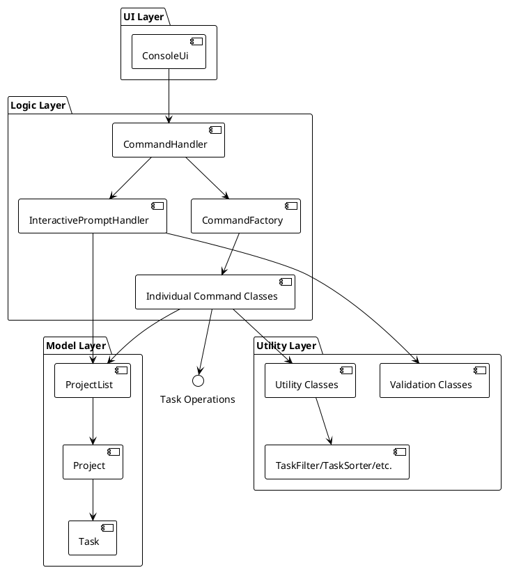

**Key Design Principles:**

- **Single Responsibility**: Each class has one primary responsibility
- **Dependency Injection**: Components receive dependencies rather than creating them
- **Command Pattern**: All operations implemented as command objects
- **Layered Architecture**: UI → Logic → Model separation

---

## Implementation & Design

### Core Functionality

Task Management: Add, update, and delete tasks.

Project Management: Create new projects.

### Data Processing

#### Task Sorting Algorithm (Yao Xiang)

The sorting algorithm supports sorting tasks by deadline or priority in ascending/descending order:

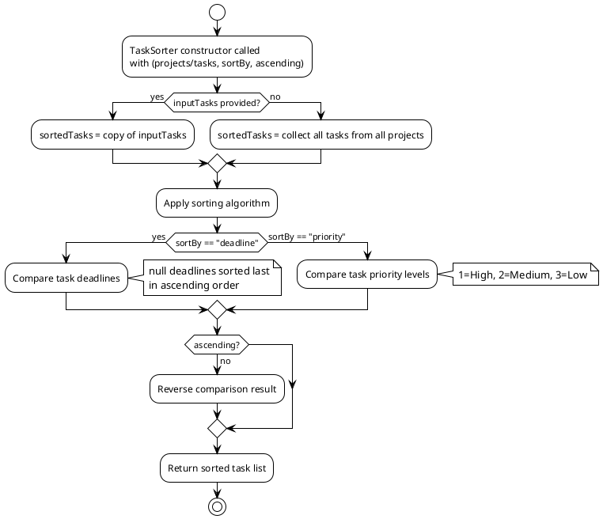

**Algorithm Details:**

- **Time Complexity**: O(n log n) using Java's built-in sort
- **Space Complexity**: O(n) for task list copy
- **Deadline Handling**: Tasks without deadlines are sorted last in ascending order
- **Priority Mapping**: High(1) > Medium(2) > Low(3)

#### Task Filtering Algorithm (Yao Xiang)

The filtering algorithm supports filtering tasks by priority level and/or project name:

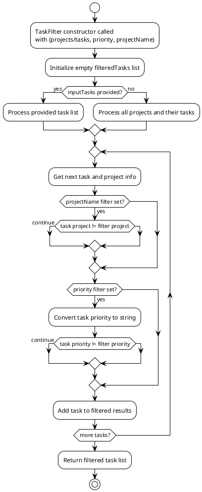

**Algorithm Details:**

- **Time Complexity**: O(n) linear scan through all tasks
- **Space Complexity**: O(m) where m is number of matching tasks
- **Case Insensitive**: Project name and priority filtering ignore case
- **Multiple Filters**: Can combine priority and project name filters

### Data Persistence

Export: Export current project and task data to a file.

### **User Interface**

### Interactive Mode (Yao Xiang)

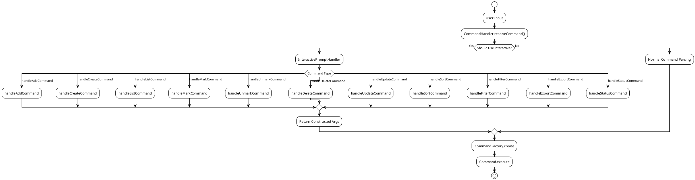

#### Implementation Overview

The interactive mode transforms single-word commands into guided conversations. When a user types "add" without arguments, the system prompts for project selection, task details, and optional fields.

#### Class Diagram: InteractivePromptHandler Structure (Yao Xiang)

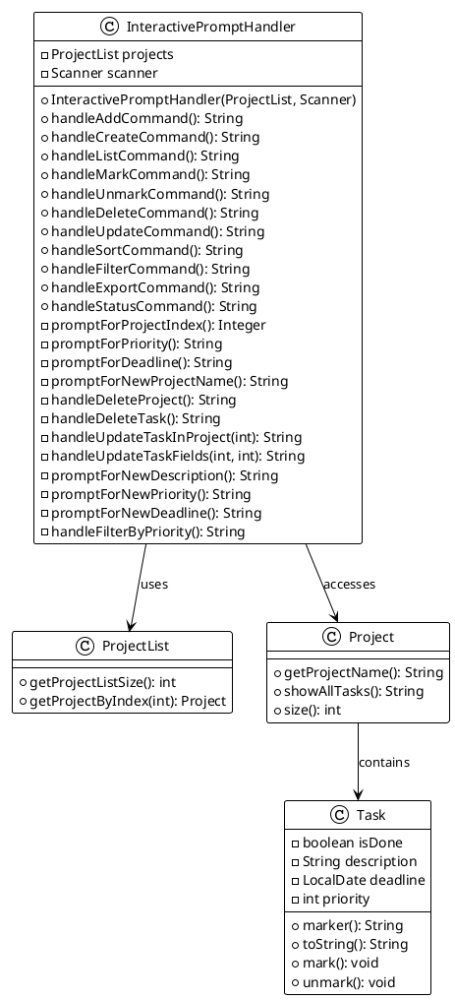

#### Interactive Mode Detection (Yao Xiang)

The `CommandHandler.shouldUseInteractiveMode()` method determines when to trigger interactive mode:

```java
private boolean shouldUseInteractiveMode(CommandParser.ParsedCommand parsed) {
    switch (parsed.getType()) {
    case ADD_TASK:
        return parsed.getArguments().trim().isEmpty();
    case CREATE_PROJECT:
        return parsed.getArguments().trim().isEmpty();
    case LIST:
        return parsed.getArguments().trim().isEmpty();
    case MARK:
        return parsed.getArguments().trim().isEmpty();
    case UNMARK:
        return parsed.getArguments().trim().isEmpty();
    case DELETE:
        return parsed.getArguments().trim().isEmpty();
    case UPDATE:
        return parsed.getArguments().trim().isEmpty();
    case SORT:
        return parsed.getArguments().trim().isEmpty();
    case FILTER:
        return parsed.getArguments().trim().isEmpty();
    case EXPORT:
        return parsed.getArguments().trim().isEmpty();
    case STATUS:
        return parsed.getArguments().trim().isEmpty();
    default:
        return false;
    }
}
```

**Decision Rationale**: Interactive mode is triggered for main commands with empty arguments, preserving backward compatibility.

#### Task Status Display System (Zhen Zhao)

Tasks display completion status using visual markers:

```java
public String marker() {
    return isDone ? "[X]" : "[ ]";
}

public String toString() {
    StringBuilder sb = new StringBuilder();
    sb.append(marker()).append(" ").append(description);
    if (deadline != null) {
        sb.append(" (Due: ").append(deadline).append(")");
    }
    sb.append(" [").append(getPriorityString()).append("]");
    return sb.toString();
}
```

**Display Example**:

```
1. [X] Implement login feature (Due: Dec 31, 2024) [high]
2. [ ] Write unit tests [medium]
3. [ ] Fix bug in parser [low]
```

#### Interactive Command Flows (Yao Xiang)

#### Add Command Flow (Yao Xiang)

The add command guides users through project selection, task description, priority, and optional deadline:

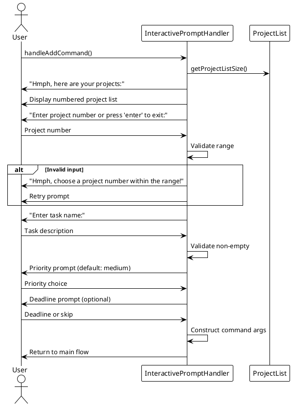

**Key Features**:

- Project validation with range checking
- Required task description with empty string rejection
- Optional priority (defaults to "medium")
- Optional deadline with YYYY-MM-DD format validation

#### Add Command State Flow (Yao Xiang)

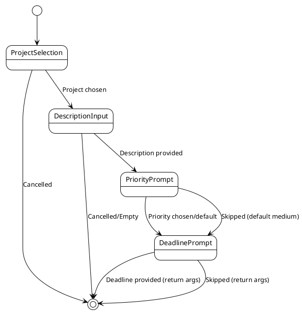

**Optional Fields**: Priority and deadline can be skipped, defaulting to "medium" and no deadline respectively.

#### Mark/Unmark Command Flows (Yao Xiang)

Mark and unmark commands share similar logic but with different validation:

```java
public String handleMarkCommand() {
    Integer projectSelection = promptForProjectIndex();
    if (projectSelection == null) return null;

    // Display tasks with status markers
    System.out.println("Hmph, which tasks do you want to mark as done in " + projectName + ":");
    for (int i = 0; i < project.size(); i++) {
        var task = project.getProjectTasks().get(i);
        String status = task.isDone() ? "x" : " ";
        System.out.println((i + 1) + ". [" + status + "] " + task.getDescription());
    }

    // Multiple task selection with comma separation
    String input = scanner.nextLine().trim();
    String[] indices = input.split(",");
    // ... validation and construction
}
```

**Mark vs Unmark Validation**:

- **Mark**: Prevents marking already completed tasks
- **Unmark**: Prevents unmarking already incomplete tasks
- **Error Message**: "Your task is not even marked, what do you want me to unmark!"

#### Delete Command Flow (Yao Xiang)

Delete command uses a two-stage approach: type selection then specific item selection with confirmation:

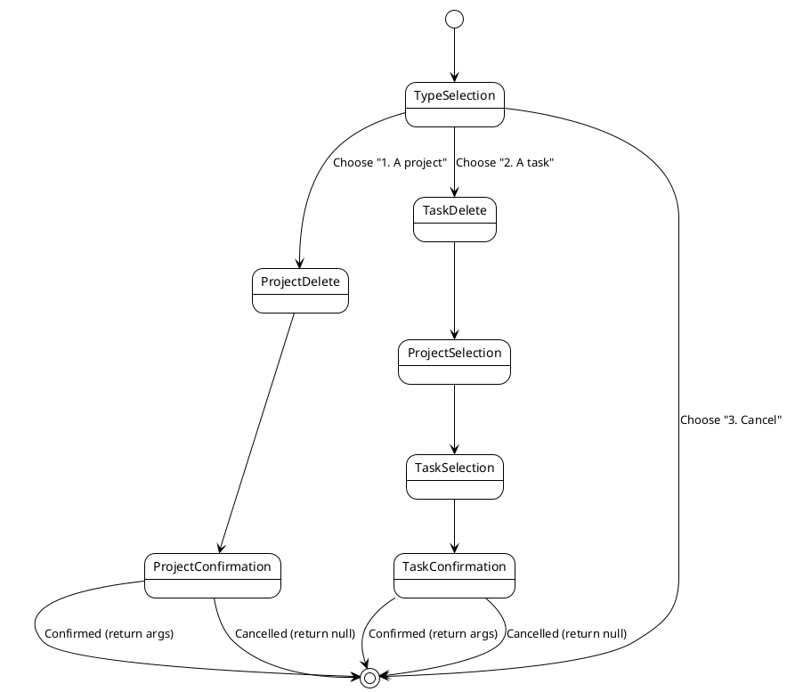

**Safety Features**:

- Confirmation prompts for all destructive operations
- Clear project/task listing before selection
- Case-insensitive confirmation ("y", "yes", "n", "no")

#### Update Command Flow (Yao Xiang)

Update command implements recursive field updates allowing multiple changes in one session:

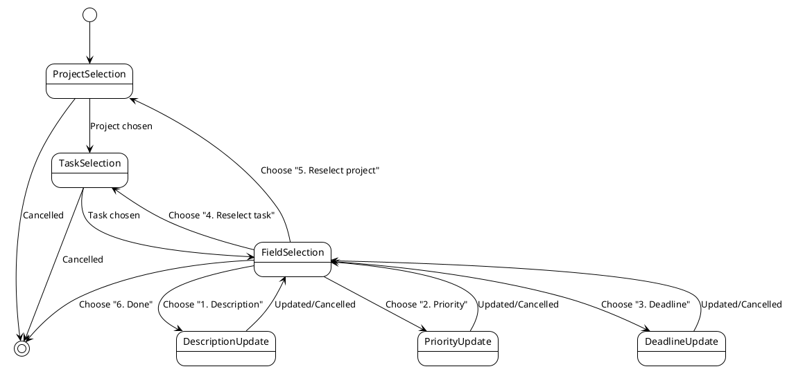

**Recursive Design**: Users can update multiple fields without restarting the flow, with options to reselect tasks/projects or exit at any point.

#### Export Command Flow (Yao Xiang)

Export command offers multiple export options with filtering and sorting:

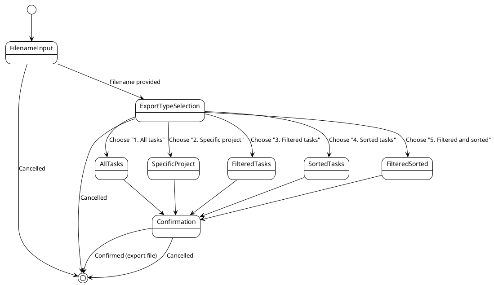

**Complex Options**: Supports all combinations of project selection, filtering, and sorting with final confirmation.

#### Create Command Flow (Yao Xiang)

Create command prompts for a new project name with validation:

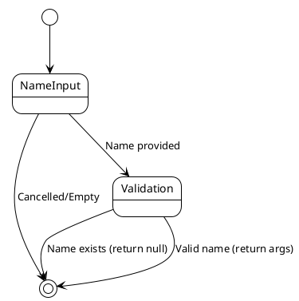

**Validation**: Checks for empty names and duplicate project names.

#### Mark/Unmark Command Flows (Yao Xiang)

Mark and unmark commands follow identical selection flow with different validation:

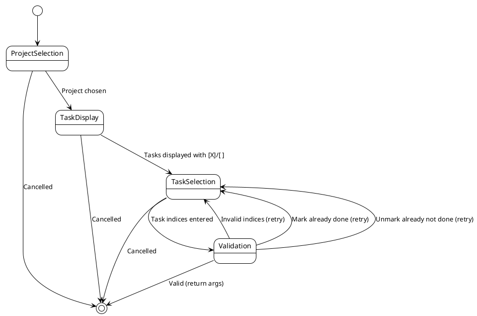

**Shared Logic**: Both commands use identical project/task selection but different validation rules.

#### Sort Command Flow (Yao Xiang)

Sort command offers field and order selection:

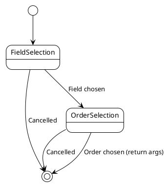

**Simple Flow**: Two sequential choices with no complex validation.

#### Filter Command Flow (Yao Xiang)

Filter command offers priority level selection:

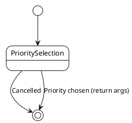

**Single Choice**: Simple selection from three priority options.

#### List Command Flow (Yao Xiang)

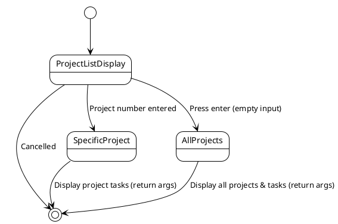

**Display Logic**: Shows numbered project list, then either displays tasks for selected project or all projects with all tasks.

#### Status Command Flow (Yao Xiang)


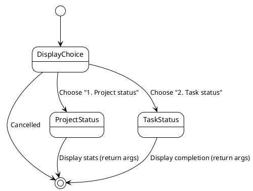

**Status Types**: Shows either project-level statistics or task completion summaries.

---

## Product scope

---

### Target user profile

{Describe the target user profile}

---

### Value proposition

{Describe the value proposition: what problem does it solve?}

---

## User Stories

| Version | As a ... | I want to ...             | So that I can ...                                           |
| ------- | -------- | ------------------------- | ----------------------------------------------------------- |
| v1.0    | new user | see usage instructions    | refer to them when I forget how to use the application      |
| v2.0    | user     | find a to-do item by name | locate a to-do without having to go through the entire list |

---

## Non-Functional Requirements

{Give non-functional requirements}

---

## Glossary

* *glossary item* - Definition
* dfsdf
*

---

## Instructions for manual testing

{Give instructions on how to do a manual product testing e.g., how to load sample data to be used for testing}
