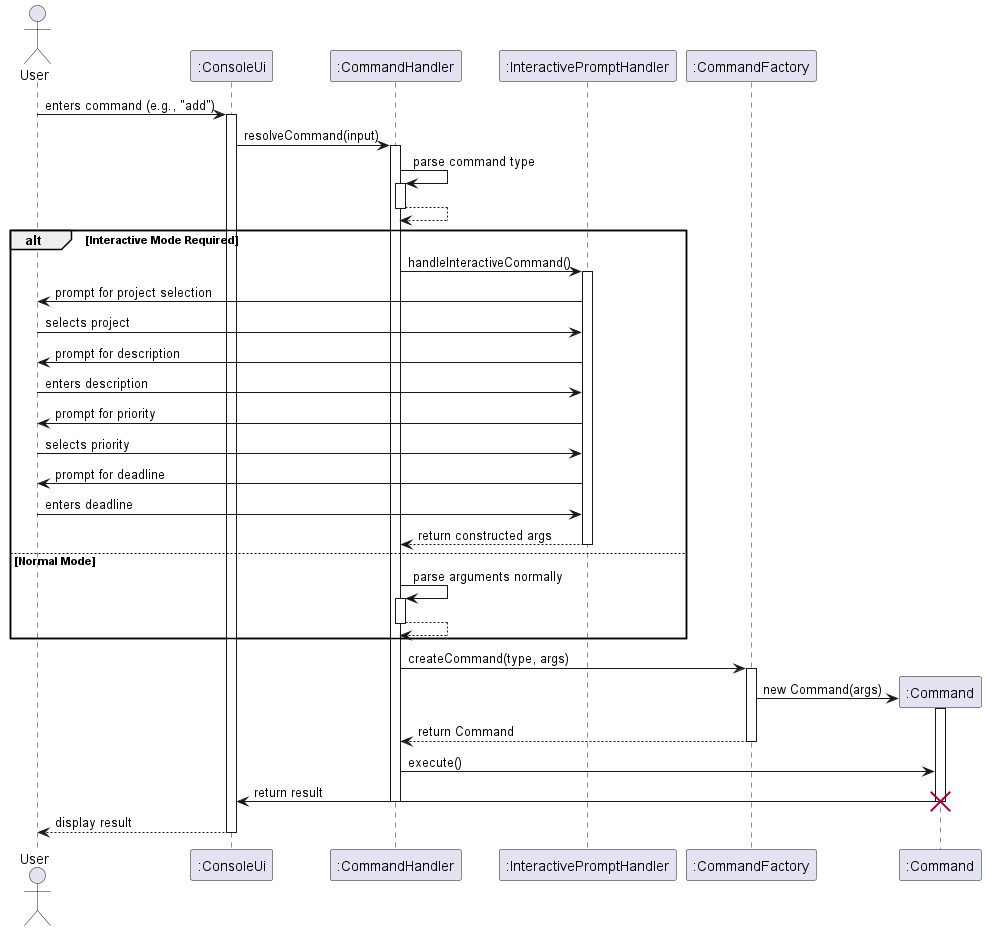
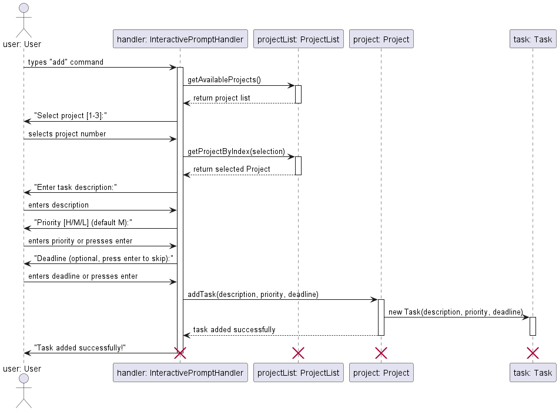
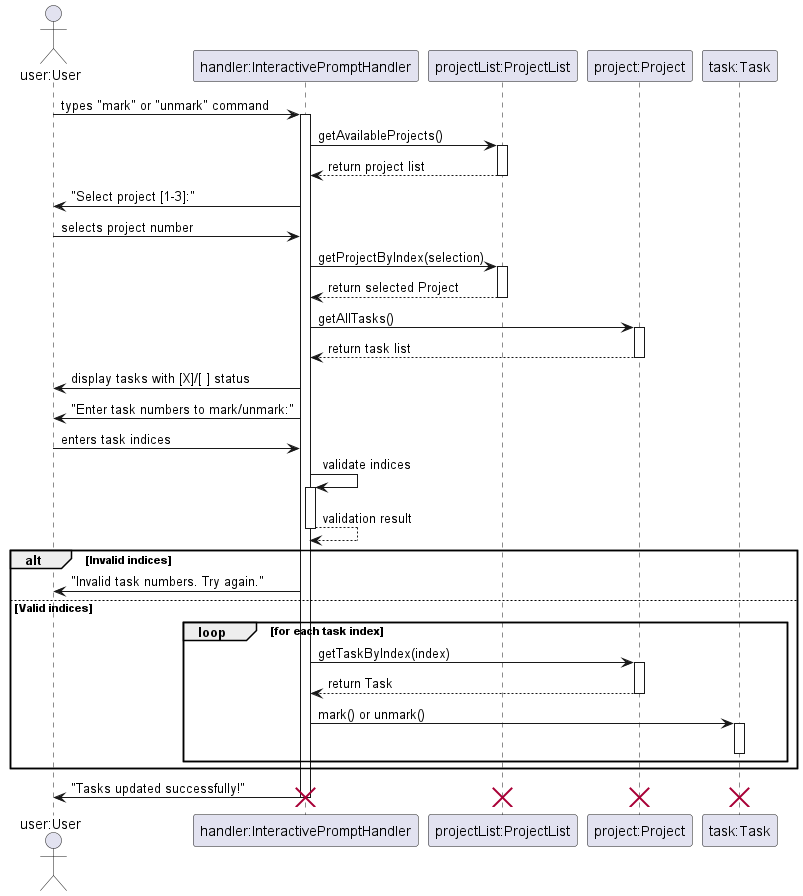

# Developer Guide

---

## Acknowledgements

This project is based on AddressBook-Level3 (AB3) from the [SE-EDU initiative](https://se-education.org).
We adapted its architecture, parser logic, and command execution framework.

We also acknowledge:

- [PlantUML](https://plantuml.com) for UML diagram generation.
- NUS CS2113 teaching team for guidance and templates.

---

## Table of Contents

- [Architecture](#architecture-by-yao-xiang)
- [Implementation &amp; Design](#implementation--design)
  - [Core Functionality](#core-functionality)
    - [Command Processing Infrastructure](#command-processing-infrastructure-by-zhenzhao)
    - [Validation Framework](#validation-framework-by-sean-lee)
    - [Task Management Features](#task-management-features-by-zing-jen)
    - [Project Management Features](#project-management-features-by-xylon-chan)
    - [Common Classes](#common-classes-by-zhenzhao)
  - [Data Processing](#data-processing)
    - [Task Sorting Algorithm](#task-sorting-algorithm-by-yao-xiang)
    - [Task Filtering Algorithm](#task-filtering-algorithm-by-yao-xiang)
  - [Data Persistence](#data-persistence-by-sean-lee)
    - [Export Algorithm](#export-algorithm-by-sean-lee)
  - [User Interface](#user-interface)
    - [Interactive Mode](#interactive-mode-by-yao-xiang)
    - [Status Display System](#status-display-system-by-zhenzhao)
    - [Interactive Command Flows](#interactive-command-flows-by-yao-xiang)
- [Product scope](#product-scope)
- [User Stories](#user-stories)
- [Non-Functional Requirements](#non-functional-requirements-by-zhenzhao)
- [Glossary](#glossary)
- [Instructions for manual testing](#instructions-for-manual-testing)

---

## Architecture by [Yao Xiang](team/yxiang-828.md)

FlowCLI follows a layered architecture with clear separation of concerns:


**Component Relationships:**

The diagram shows the main components and their relationships:
- **ConsoleUi** handles all user interface interactions
- **CommandHandler** orchestrates command processing
- **InteractivePromptHandler** manages interactive mode dialogues
- **CommandFactory** creates command objects
- **ProjectList** contains multiple **Project** instances (1-to-many relationship)
- **Project** contains multiple **Task** instances (1-to-many relationship)
- **TaskSorter** and **TaskFilter** provide data processing utilities

*Note: The multiplicity notation "1" → "*" indicates a one-to-many relationship in UML. For example, one ProjectList can contain zero or more Projects, and one Project can contain zero or more Tasks.*

**Key Design Principles:**

- **Single Responsibility**: Each class has one primary responsibility
- **Dependency Injection**: Components receive dependencies rather than creating them
- **Command Pattern**: All operations implemented as command objects
- **Layered Architecture**: UI → Logic → Model separation

---

## Implementation & Design

### Core Functionality

#### Command Processing Infrastructure by [Zhenzhao](team/zhenzha0.md)

The command processing infrastructure forms the foundation of FlowCLI, handling all user input parsing, validation, and command execution. It consists of three key components that work together to transform user input into executable commands.

**Key Components:**

- **CommandHandler** - Manages the main command loop, reads user input, coordinates parsing and execution
- **CommandParser** - Parses command words and extracts arguments, maps input to CommandType enum
- **ArgumentParser** - Parses project identifiers (index or name), resolves to Project objects, validates existence


**Implementation Details:**

1. **FlowCLI** initializes by creating CommandHandler, CommandParser, CommandFactory, and ConsoleUi (these objects exist throughout the application lifecycle).
2. **CommandHandler** manages the main command loop, reading user input line by line using a Scanner.
3. For each input line, **CommandParser** splits the command word from arguments and maps it to a CommandType enum.
4. **CommandFactory** creates a new Command object for each user input based on the type.
5. During command execution, a new **ArgumentParser** is created to validate and resolve project identifiers (if applicable), converting indices or names into Project objects. This parser is destroyed after parsing completes.
6. The Command validates arguments, performs business logic, and displays results through ConsoleUi.
7. After execution, the Command object is destroyed (each command is executed once and discarded).
8. Exceptions are caught and handled gracefully, displaying user-friendly error messages.

**Note:** The sequence diagram shows constructor calls only for objects created during the command processing flow (Command and ArgumentParser). Pre-existing components (FlowCLI, CommandHandler, CommandParser, CommandFactory, ConsoleUi) are created during application initialization and persist throughout the session.

**Design Rationale:**

- **Separation of Concerns**: CommandParser handles syntax, ArgumentParser handles semantics, CommandHandler orchestrates the flow.
- **Reusability**: ArgumentParser is used by multiple commands that need project resolution.
- **Extensibility**: New commands can be added by extending the CommandType enum and Command base class.
- **Error Handling**: Validation happens early in the pipeline, preventing invalid state changes.

**Example Flow:**

```
User input: "add-task 1 Fix bug --priority high"
↓
CommandParser: type=ADD_TASK, args="1 Fix bug --priority high"
↓
ArgumentParser: projectIndex=1 → resolves to Project("CS2113T"), remaining="Fix bug --priority high"
↓
AddCommand: validates and adds task to project
↓
ConsoleUi: displays confirmation
```

---

#### Validation Framework by [Sean Lee](team/sean6369.md)

Input validation is centralized to ensure consistent rules, clear error messages, and early failure before any state mutation.

**Key Components:**

- `CommandValidator` - Static utility methods for validating command parameters (priorities, dates, filter/sort options, command syntax)
- `ValidationConstants` - Canonical constants for valid values (priorities, filter types, sort fields/orders, keywords)

**CommandValidator Methods:**

- `validatePriority(String)` - Validates and normalizes priority (`low`, `medium`, `high`, case-insensitive), throws `InvalidArgumentException` on failure
- `priorityToInt(String)` - Converts validated priority string to integer (1=low, 2=medium, 3=high); use after `validatePriority()`
- `validateAndParseDate(String)` - Validates date format (`yyyy-MM-dd`) and returns `LocalDate`, throws `InvalidDateException` on failure
- `validateFilterType(String)` - Validates filter type (currently only `priority`), throws `InvalidArgumentException` on failure
- `validateSortField(String)` - Validates sort field (`deadline` or `priority`), throws `InvalidArgumentException` on failure
- `validateSortOrder(String)` - Validates sort order (`ascending` or `descending`), throws `InvalidArgumentException` on failure
- `validateFilterCommand(String[], int)` - Validates filter command syntax completeness, throws `InvalidCommandSyntaxException` on failure
- `validateSortCommand(String[], int)` - Validates sort command syntax completeness, throws `InvalidCommandSyntaxException` on failure

**ValidationConstants Values:**

- Priorities: `PRIORITY_LOW`, `PRIORITY_MEDIUM`, `PRIORITY_HIGH` (string values)
- Priority integers: `PRIORITY_LOW_VALUE = 1`, `PRIORITY_MEDIUM_VALUE = 2`, `PRIORITY_HIGH_VALUE = 3`
- Filter types: `FILTER_TYPE_PRIORITY`
- Sort fields: `SORT_FIELD_DEADLINE`, `SORT_FIELD_PRIORITY`
- Sort orders: `SORT_ORDER_ASCENDING`, `SORT_ORDER_DESCENDING`
- Keywords: `KEYWORD_BY`, `KEYWORD_FILTER`, `KEYWORD_SORT`

**Parser Integration:**

- `CommandParser.parseIndexOrNull(String indexText, int maxIndex)`

  - Parses a 1-based user index and converts to 0-based on success
  - Validates index is within range [1, maxIndex]
  - Throws: `MissingIndexException` (if indexText is null), `InvalidIndexFormatException` (if not numeric), `IndexOutOfRangeException` (if out of range)
  - Returns the 0-based index (never returns null; throws exceptions on validation failure)
- `ArgumentParser.validateProjectIndex()`

  - Verifies that a target project is resolvable from user input
  - Detects non-numeric tokens and out-of-range indices against the current project list
  - Must be called after `ArgumentParser` construction to validate parsed project index
  - Throws: `MissingArgumentException`, `InvalidIndexFormatException`, `IndexOutOfRangeException`, `InvalidArgumentException`

**Usage Example:**

```java
// Typical validation pattern in commands (e.g., AddCommand, UpdateCommand)
ArgumentParser parsedArgument = new ArgumentParser(arguments, context.getProjects());
parsedArgument.validateProjectIndex();  // Validate project index first
Project targetProject = parsedArgument.getTargetProject();

String remaining = parsedArgument.getRemainingArgument();
if (remaining == null || remaining.trim().isEmpty()) {
    throw new MissingDescriptionException();  // Validate required fields
}

// Validate and convert priority
String validatedPriority = CommandValidator.validatePriority(priorityStr);
int priority = CommandValidator.priorityToInt(validatedPriority);

// Validate and parse date
LocalDate deadline = CommandValidator.validateAndParseDate(dateStr);
```

**Extra Parameter Validation:**

Commands that don't accept parameters (e.g., `bye`, `help`, `status`, `list`) check for extra arguments using `ArgumentParser.getRemainingArgument()` and throw `ExtraArgumentException`:

```java
String remaining = parsedArgument.getRemainingArgument();
if (remaining != null && !remaining.trim().isEmpty()) {
    throw new ExtraArgumentException("Unexpected extra parameters: " + remaining);
}
```

**Exception Types:**

- `MissingArgumentException` - Required argument is missing
- `ExtraArgumentException` - Unexpected extra parameters provided
- `MissingIndexException` - Required index argument is missing
- `MissingDescriptionException` - Required description/field is missing or empty
- `InvalidIndexFormatException` - Index cannot be parsed as integer
- `IndexOutOfRangeException` - Index is out of valid range
- `InvalidArgumentException` - Argument format/value is invalid (e.g., invalid priority, filter type, sort field)
- `InvalidDateException` - Date format is invalid (expects `yyyy-MM-dd`)
- `InvalidFilenameException` - Filename format is invalid
- `InvalidCommandSyntaxException` - Command syntax is malformed or incomplete

**Validation Flow:**

The following sequence diagram illustrates the validation process, showing both success and exception paths:


The validation flow operates in 3 main layers:

1. **Project Index layer**: `ArgumentParser.validateProjectIndex()` validates project index format and range (throws `MissingArgumentException`, `IndexOutOfRangeException`, `InvalidIndexFormatException`) - *always executed first*
2. **Task Index layer**: `CommandParser.parseIndexOrNull()` validates task index format and range (throws `MissingIndexException`, `InvalidIndexFormatException`, `IndexOutOfRangeException`) - *only for commands that need task indices (Mark, Update, DeleteTask, Unmark)*
3. **Domain layer**: Commands use `CommandValidator` methods for domain-specific validation (priorities, dates, filters, sort options) which reference `ValidationConstants` for valid values

All exceptions propagate to `CommandHandler`, which catches `FlowCLIException` and displays user-friendly messages via `ConsoleUi`.

**Pre-execution validation**: All validation occurs before model mutation to preserve data integrity.

**Best Practices:**

- Always validate project index first using `ArgumentParser.validateProjectIndex()` before accessing project data
- Validate optional parameters (priority, deadline) before using them
- Use `validatePriority()` followed by `priorityToInt()` to normalize and convert priorities
- Check for extra parameters on commands that don't accept arguments
- Throw specific exception types rather than generic ones for better error messages

---

#### Task Management features by [Zing Jen](team/zeeeing.md)

The task management system forms the core of FlowCLI, allowing users to create, track, and manage their work within different projects. The implementation follows the command pattern, where each user action is encapsulated in a dedicated command class.

##### `add-task` command

The `add-task` command allows users to add a new task to a specified project. Users can provide a task description, an optional deadline, and an optional priority.

**Command format**: `add-task <projectIndex> <description> [--priority <level>] [--deadline <YYYY-MM-DD>]`

The following sequence diagram illustrates the process of adding a task:


**Implementation Details**:

1. The `CommandParser` identifies the `add-task` command and creates an `AddCommand` object.
2. `AddCommand#execute()` is called.
3. The command parses the arguments to extract the project index, task description, deadline, and priority.
4. It validates that the project exists and that a task description is provided.
5. If validation passes, it retrieves the `Project` object and calls `project.addTask()` to create and add the new task.
6. The `ConsoleUi` then displays a confirmation message to the user.

---

##### `delete-task` command

The `delete-task` command is used to remove a task from a project. It requires the project index and the 1-based index of the task to be deleted.

**Command format**: `delete-task <projectIndex> <taskIndex>`

The sequence diagram below shows the workflow:


**Implementation Details**:

1. The `CommandParser` creates a `DeleteTaskCommand` object.
2. `DeleteTaskCommand#execute()` validates the presence of the project index and task index.
3. It ensures the specified project exists and the task index is within the valid range.
4. If valid, it calls `project.deleteTask()` to remove the task from the project's `TaskList`.
5. A success message, including the details of the deleted task, is shown to the user.

---

##### `mark` and `unmark` commands

These commands allow users to change the completion status of a task.

- `mark`: Marks a task as done.
- `unmark`: Marks a task as not done.

**Command format**:

- `mark <projectIndex> <taskIndex>`
- `unmark <projectIndex> <taskIndex>`

The process is illustrated in the following diagram:


**Implementation Details**:

1. `MarkCommand` or `UnmarkCommand` is instantiated by the parser.
2. The `execute()` method validates the project and task index.
3. It retrieves the `Task` object and calls its `mark()` or `unmark()` method.
4. The command includes logic to prevent redundant operations (e.g., marking an already-marked task).
5. The UI confirms that the task status has been updated.

---

##### `update-task` command

The `update-task` command modifies the attributes of an existing task, such as its description, deadline, or priority.

**Command format**: `update-task <projectIndex> <taskIndex> [--description <desc>] [--deadline <YYYY-MM-DD|none>] [--priority <level>]`

The update process is shown below:


**Implementation Details**:

1. The `UpdateCommand` is responsible for parsing the various optional flags that specify which fields to update.
2. It validates the project and task index.
3. It calls `project.updateTask()`, passing the new values. The `updateTask` method handles the logic of only changing the fields that were provided in the command.
4. The UI displays the updated task details.

---

##### `list` command

The `list` command displays tasks. It can either list all tasks in all projects or list the tasks of a specific project.

**Command format**: `list --all` or `list <projectIndex>`

The diagram below illustrates the listing process:


**Implementation Details**:

1. The `ListCommand` checks if a project index or `--all` flag was provided.
2. **Argument Validation**:
   - Checks for empty arguments (throws `MissingArgumentException`)
   - If `--all` flag, validates project list is not empty (throws `EmptyProjectListException`)
   - If project index provided, validates the index and rejects unexpected extra parameters (e.g., `list 1 extra` throws exception)
3. If a valid project index is given, it finds the project and calls `ConsoleUi` to display only the tasks for that project.
4. If `--all` flag is given, it iterates through the entire `ProjectList` and instructs the `ConsoleUi` to display all projects and their associated tasks.

#### Project Management features by [Xylon Chan](team/xylonc.md)

##### CreateCommand

The `Create-project` command is facilitated by `ProjectList`and it is accessed by `CommandContext`. It extends `Command` with the feature of reading the user's project name input and creating a project entity.
Additionally , it implements the following operations:

- `ProjectList#getProject(String name)` - returns the project if it exists, or `null` if not found.
- `ProjectList#addProject(String name)` - adds a new project with the given name.
- `ConsoleUi#showAddedProject()` - notifies the user after successful creation.
- `CommandContext#getProjects()` - returns all the projects currently in the ProjectList

Given below is an example usage scenario and how the `create-project` feature behaves at each step

**User Input**: The user enters the `create-project` command with the project name (e.g., `create-project Alpha`).

**Parsing**: The CommandParser identifies the command as `create-project` and constructs a CreateCommand with the raw arguments.

**Execution**: The FlowCLI main loop invokes CreateCommand#execute(CommandContext). (Note: CreateCommand extends Command.)

**Argument Parsing**: Inside execute, CreateCommand extracts the project name from the arguments

**Validation**: The command validates that the name is non-blank; if blank, it throws `MissingArgumentException`. It then checks duplicates via `context.getProjects().getProject(name)` if present, it throws `ProjectAlreadyExistsException`.

**Creating the Project**: On success, the command calls `context.getProjects().addProject(name)` to persist the new project in the model.

**UI Feedback**: The command obtains the UI via context.getUi() and calls showAddedProject() (or the equivalent success method) to confirm creation to the user.

**Return/Logging**: The command returns true to signal success and logs at info/fine levels; failures log at warning and do not mutate the model.

Here is a sequence diagram illustrating the process:


#### Common Classes by [Zhenzhao](team/zhenzha0.md)

The core data model of FlowCLI consists of four fundamental classes that represent the domain entities and their relationships. These classes form the foundation upon which all features are built.

##### Project, ProjectList, Task, and TaskList classes


**Class Relationships:**

- **ProjectList** contains multiple **Project** instances
- Each **Project** contains a **TaskList**
- Each **TaskList** contains multiple **Task** instances

This hierarchical structure allows for organized task management within distinct projects, with clear ownership and encapsulation of responsibilities.

#### Project class

##### Overview

Represents a single project and encapsulates its name and task collection `TaskList`. Allows for adding/updatig/deleting tasks within a project without directly coordinating multiple lower-level classes.

##### Requirements

`projectName` is non null and should be non-blank when constructed
`projectTasks` is non null after construction

##### Helping classes

- `TaskList` and `Task` (for managing per-project tasks).

-`ProjectList (container)` creates and returns Project instances.

##### API

- `Project(String projectName)` — Constructor that constructs an empty project with the given name.
- `String getProjectName()` — returns the name of the project.
- `TaskList getProjectTasks()` — returns the tasks in that project
- `void addTask(String description)` — adds a task.
- `void addTask(String description, LocalDate deadline, int priority)` — add a task with deadline and priority
- `Task deleteTask(int index) — remove and return the task at index.`
- `Task updateTask(int index, String newDescription, boolean updateDescription, LocalDate newDeadline, boolean updateDeadline, Integer newPriority, boolean updatePriority)` — Updates the task description , deadline and priority
- `String showAllTasks()` — render the project’s tasks to a printable string (delegates to `TaskList.render()`).
- `String toString()` — printable representation of the project header + rendered tasks.

#### ProjectList class

##### Overview

An ArrayList container of Project instances offering indexed access, name-lookup, and simple rendering. This is the central point for commands to manipuate the collection of projects (e.g., create-project, delete-project, list-projects).

##### Requirements

`projects` is non null after construction

##### Helping classes

- `Project` - element sotred in the list.

##### API

- `void addProject(String projectName)` — appends a new Project.
- `Project delete(int zeroBasedIndex)` — delete by index, return the removed Project for confirmation.
- `Project deleteProject(Project project)` — remove by identity and returns the removed project
- `Project getProjectByIndex(int zeroBasedIndex)` — indexed accessor.
- `List<Project> getProjectList()` — list the projects by name currently in the list
- `int getProjectListSize()` — returns the number of projects.
- `Project getProject(String projectName)` — returns the project via name-based lookup
- `String render()` — concatenate each project’s toString() into a printable block.

### Data Processing

#### Task Sorting Algorithm by [Yao Xiang](team/yxiang-828.md)

The sorting algorithm supports sorting tasks by deadline or priority in ascending/descending order:


**Algorithm Details:**

- **Time Complexity**: O(n log n) using Java's built-in sort
- **Space Complexity**: O(n) for task list copy
- **Deadline Handling**: Tasks without deadlines are sorted last in ascending order
- **Priority Mapping**: High(1) > Medium(2) > Low(3)

#### Task Filtering Algorithm by [Yao Xiang](team/yxiang-828.md)

The filtering algorithm supports filtering tasks by priority level and/or project name:


**Algorithm Details:**

- **Time Complexity**: O(n) linear scan through all tasks
- **Space Complexity**: O(m) where m is number of matching tasks
- **Case Insensitive**: Project name and priority filtering ignore case
- **Multiple Filters**: Can combine priority and project name filters

### Data Persistence by [Sean Lee](team/sean6369.md)

#### Export Algorithm by [Sean Lee](team/sean6369.md)

The export algorithm supports saving project and task data to text files with filtering and sorting capabilities:

##### Architecture Overview


**Key Components:**

- **ExportCommandHandler** - Orchestrates export process, parameter parsing, and view state management
- **TaskCollector** - Utility class for aggregating tasks from projects with project context
- **TaskExporter** - Utility class for file I/O operations with comprehensive error handling
- **TaskWithProject** - Wrapper class enabling cross-project operations
- **TaskFilter** - Filters tasks by priority and/or project name
- **TaskSorter** - Sorts tasks by deadline or priority

**Design Principles:**

- **Separation of Concerns**: Collection (TaskCollector), I/O (TaskExporter), and orchestration (ExportCommandHandler) are separate
- **Utility Pattern**: TaskCollector and TaskExporter are final classes with static methods only
- **Reusability**: TaskWithProject enables cross-project operations across filtering, sorting, and listing
- **Error Isolation**: All I/O exceptions are translated to FileWriteException with user-friendly messages

##### Export Workflow

The following sequence diagram illustrates the export workflow:


##### TaskCollector

Utility class providing static methods to collect tasks from projects while preserving project association:

- **`getAllTasksWithProjects(ProjectList projects)`** - Returns `List<TaskWithProject>` of all tasks from all projects (O(n) time/space)
- **`getTasksFromProject(Project project)`** - Returns `List<TaskWithProject>` of tasks from a specific project (O(m) time/space)

Each task is wrapped in `TaskWithProject`, which formats as `"ProjectName: [X] Task Description (Due: YYYY-MM-DD) [priority]"`. The class is reusable across filtering, sorting, and listing operations.

##### TaskExporter

Utility class that writes tasks to text files with comprehensive error handling:

**Method:** `exportTasksToFile(List<TaskWithProject> tasks, String filename, String header) throws FileWriteException`

**File Format:**

```
<Header Text>
================

ProjectName: [X] Task Description (Due: YYYY-MM-DD) [priority]
ProjectName: [ ] Another Task [priority]
```

Uses try-with-resources for automatic cleanup. All I/O exceptions are translated to `FileWriteException` with user-friendly messages covering: permission denied, directory not found, disk space issues, file locking, path length limits, read-only filesystem, and security policy violations. Error messages follow the pattern `"'<filename>': <description>"` with actionable suggestions.

##### Integration with ExportCommandHandler

The export workflow consists of 5 steps:

1. **Parameter Parsing** - Validates filename, project selection, filters, and sorting options
2. **Task Collection** - Uses `TaskCollector` based on parameters with 4 strategies:
   ```java
   if (params.forceAll) {
       tasks = TaskCollector.getAllTasksWithProjects(projects);
   } else if (params.projectIndex != null) {
       tasks = TaskCollector.getTasksFromProject(projects.getProjectByIndex(params.projectIndex));
   } else if (!params.hasFilterOrSort() && lastViewType != ViewType.NONE && !lastDisplayedTasks.isEmpty()) {
       tasks = new ArrayList<>(lastDisplayedTasks);  // Export last cached view (from sort/filter)
   } else {
       tasks = TaskCollector.getAllTasksWithProjects(projects);  // Default: all tasks
   }
   ```

   **Last View Caching:** View state is stored in `ExportCommandHandler` instance fields (`lastDisplayedTasks`, `lastViewType`, `lastViewMetadata`). The `sort-tasks` and `filter-tasks` commands update this state via `updateViewState()`. When exporting without parameters, it automatically exports the cached view if available.
3. **Filtering/Sorting** - Applies `TaskFilter` and `TaskSorter` if specified in export command
4. **File Export** - Calls `TaskExporter.exportTasksToFile()` with header
5. **User Feedback** - Displays success via `ConsoleUi.showExportSuccess()`

**Design Benefits:** Separation of concerns, reusability across operations, error isolation, independent testability, and seamless integration with view commands (sort/filter) through view state tracking.

### **User Interface**

### Interactive Mode by [Yao Xiang](team/yxiang-828.md)


#### Implementation Overview

The interactive mode transforms single-word commands into guided conversations. When a user types "add" without arguments, the system prompts for project selection, task details, and optional fields.

#### Command Processing Sequence by [Yao Xiang](team/yxiang-828.md)

The overall command processing workflow shows how user input flows through the system components:



**Architecture Flow**: User input → CommandHandler → InteractivePromptHandler (if needed) → CommandFactory → Command execution → Result display.

#### Class Diagram: InteractivePromptHandler Structure by [Yao Xiang](team/yxiang-828.md)


#### Interactive Mode Detection by [Yao Xiang](team/yxiang-828.md)

The `CommandHandler.shouldUseInteractiveMode()` method determines when to trigger interactive mode:

```java
private boolean shouldUseInteractiveMode(CommandParser.ParsedCommand parsed) {
    switch (parsed.getType()) {
    case ADD_TASK:
        return parsed.getArguments().trim().isEmpty();
    case CREATE_PROJECT:
        return parsed.getArguments().trim().isEmpty();
    case LIST:
        return parsed.getArguments().trim().isEmpty();
    case MARK:
        return parsed.getArguments().trim().isEmpty();
    case UNMARK:
        return parsed.getArguments().trim().isEmpty();
    case DELETE:
        return parsed.getArguments().trim().isEmpty();
    case UPDATE:
        return parsed.getArguments().trim().isEmpty();
    case SORT:
        return parsed.getArguments().trim().isEmpty();
    case FILTER:
        return parsed.getArguments().trim().isEmpty();
    case EXPORT:
        return parsed.getArguments().trim().isEmpty();
    case STATUS:
        return parsed.getArguments().trim().isEmpty();
    default:
        return false;
    }
}
```

**Decision Rationale**: Interactive mode is triggered for main commands with empty arguments, preserving backward compatibility.

#### Status Display System by [Zhenzhao](team/zhenzha0.md)

The status display system provides users with visual feedback on project progress through completion tracking, progress bars, and motivational messages. It separates analysis logic from presentation concerns for maintainability.

##### Architecture Overview


**Key Components:**

- **StatusCommand** - Entry point that parses arguments and coordinates status display
- **ProjectStatusAnalyzer** - Pure analysis logic that calculates completion statistics
- **ProjectStatus** - Immutable data transfer object holding project statistics
- **ConsoleUi** - Renders status information with progress bars and messages

**Design Principles:**

- **Separation of Concerns**: Analysis logic (ProjectStatusAnalyzer) is separate from UI rendering (ConsoleUi)
- **Data Transfer Objects**: ProjectStatus acts as an immutable container for statistics
- **Single Responsibility**: Each class has one clear purpose in the status display pipeline

##### Status Command Execution Flow


The above diagram shows the execution flow for displaying a specific project's status (e.g., `status 1`). The diagram focuses on the main success path for clarity.

**Execution Flow:**

1. **Command Parsing**:
   - User enters command (e.g., "status 1")
   - CommandHandler delegates to CommandParser
   - CommandParser splits command word and arguments, returns ParsedCommand
   - CommandHandler creates StatusCommand with arguments

2. **Argument Processing**:
   - StatusCommand validates arguments are not empty
   - Creates ArgumentParser to parse project identifier
   - ArgumentParser resolves project index/name to Project object
   - ArgumentParser is destroyed after returning the parsed result

3. **Status Analysis**:
   - StatusCommand calls ConsoleUi to display project status
   - ConsoleUi delegates to ProjectStatusAnalyzer for analysis
   - ProjectStatusAnalyzer:
     - Retrieves project's TaskList
     - Counts completed tasks (where `isDone() == true`)
     - Calculates completion percentage
     - Returns ProjectStatus data object

4. **UI Rendering**:
   - ConsoleUi formats the status output:
     - `formatStatusSummary()`: Creates summary text (e.g., "3/5 tasks completed, 60%")
     - `generateProgressBar()`: Creates visual progress bar `[=========>      ] 60%`
     - `getMotivationalMessage()`: Selects message based on completion percentage
   - Displays formatted output to user

5. **Cleanup**:
   - StatusCommand returns success flag
   - StatusCommand is destroyed after execution

**Note**: The command also supports displaying all projects with `status --all`, which follows a similar flow but iterates through all projects in the ProjectList.

**Task Status Markers:**

Individual tasks display completion status using visual markers in list views:

```java
public String marker() {
    return isDone ? "[X]" : "[ ]";
}
```

**Display Example**:

```
CS2113T Project - Project Status
3/5 tasks completed, 60%
[========================>               ] 60%
We are on the right track, keep completing your tasks!
```

**Motivational Messages:**

The system provides contextual encouragement based on progress:

- ≤25%: "You are kinda cooked, start doing your tasks!"
- ≤50%: "You gotta lock in and finish all tasks!"
- ≤75%: "We are on the right track, keep completing your tasks!"
- \>75%: "We are finishing all tasks!! Upzzz!"

**Status Types:**

1. **Single Project Status** (`status <projectIndex>`): Shows detailed status for one project
2. **All Projects Status** (`status --all`): Shows summary status for all projects in a compact format

#### Interactive Command Flows by [Yao Xiang](team/yxiang-828.md)

#### Add Command Flow by [Yao Xiang](team/yxiang-828.md)

The add command guides users through project selection, task description, priority, and optional deadline:



**Key Features**:

- Project validation with range checking
- Required task description with empty string rejection
- Optional priority (defaults to "medium")
- Optional deadline with YYYY-MM-DD format validation

#### Add Command State Flow by [Yao Xiang](team/yxiang-828.md)


**Optional Fields**: Priority and deadline can be skipped, defaulting to "medium" and no deadline respectively.

#### Mark/Unmark Command Flows by [Yao Xiang](team/yxiang-828.md)

Mark and unmark commands share similar logic but with different validation:

```java
public String handleMarkCommand() {
    Integer projectSelection = promptForProjectIndex();
    if (projectSelection == null) return null;

    // Display tasks with status markers
    System.out.println("Hmph, which tasks do you want to mark as done in " + projectName + ":");
    for (int i = 0; i < project.size(); i++) {
        var task = project.getProjectTasks().get(i);
        String status = task.isDone() ? "x" : " ";
        System.out.println((i + 1) + ". [" + status + "] " + task.getDescription());
    }

    // Multiple task selection with comma separation
    String input = scanner.nextLine().trim();
    String[] indices = input.split(",");
    // ... validation and construction
}
```

**Mark vs Unmark Validation**:

- **Mark**: Prevents marking already completed tasks
- **Unmark**: Prevents unmarking already incomplete tasks
- **Error Message**: "Your task is not even marked, what do you want me to unmark!"

#### Delete Command Flow by [Yao Xiang](team/yxiang-828.md)

Delete command uses a two-stage approach: type selection then specific item selection with confirmation:


**Safety Features**:

- Confirmation prompts for all destructive operations
- Clear project/task listing before selection
- Case-insensitive confirmation ("y", "yes", "n", "no")

#### Update Command Flow by [Yao Xiang](team/yxiang-828.md)

Update command implements recursive field updates allowing multiple changes in one session:


**Recursive Design**: Users can update multiple fields without restarting the flow, with options to reselect tasks/projects or exit at any point.

#### Export Command Flow by [Yao Xiang](team/yxiang-828.md)

The export command provides comprehensive data export capabilities with multiple filtering and sorting options. Users can export their project and task data in various formats and configurations.

**Key Features:**

- **Multiple Export Types**: All tasks, specific projects, filtered tasks, sorted tasks, or combined filtered and sorted exports
- **Flexible Output**: Supports various file formats (typically CSV or JSON)
- **Data Filtering**: Can filter by project name, priority levels, or completion status
- **Data Sorting**: Can sort by deadline, priority, or other task attributes
- **File Naming**: Custom filename specification for organized data management

**Export Options:**

1. **All Tasks**: Exports every task across all projects
2. **Specific Project**: Exports only tasks from a selected project
3. **Filtered Tasks**: Exports tasks matching specific criteria (priority, project, status)
4. **Sorted Tasks**: Exports tasks in sorted order (by deadline, priority, etc.)
5. **Filtered and Sorted**: Combines filtering and sorting for precise data extraction


#### Create Command Flow by [Yao Xiang](team/yxiang-828.md)

Create command prompts for a new project name with validation:


**Validation**: Checks for empty names and duplicate project names.

#### Mark/Unmark Command Flows by [Yao Xiang](team/yxiang-828.md)

Mark and unmark commands follow identical selection flow with different validation:



**Shared Logic**: Both commands use identical project/task selection but different validation rules.

#### Sort Command Flow by [Yao Xiang](team/yxiang-828.md)

Sort command offers field and order selection:


**Simple Flow**: Two sequential choices with no complex validation.

#### Filter Command Flow by [Yao Xiang](team/yxiang-828.md)

Filter command offers priority level selection:


**Single Choice**: Simple selection from three priority options.

#### List Command Flow by [Yao Xiang](team/yxiang-828.md)


**Display Logic**: Shows numbered project list, then either displays tasks for selected project or all projects with all tasks.

#### Status Command Flow by [Yao Xiang](team/yxiang-828.md)


**Status Types**: Shows either project-level statistics or task completion summaries.

## Product scope

---

### Target user profile

Individual student developers working on their own coursework, capstones, hackathons, or any other related projects that require task management to streamline their workflow.

---

### Value proposition

FlowCLI addresses the challenge of managing complex academic or personal projects by providing a streamlined, command-line interface for task and project organization. It helps student developers maintain focus, track progress, and efficiently handle multiple assignments or project phases without the overhead of graphical user interfaces. By offering quick task creation, flexible filtering, and clear status overviews, FlowCLI ensures that users can dedicate more time to coding and less to administrative overhead, ultimately boosting productivity and reducing stress.

---

## User Stories

| Version | As a ... | I want to ...                               | So that I can ...                                           |
| ------- | -------- | ------------------------------------------- | ----------------------------------------------------------- |
| v1.0    | new user | see usage instructions                      | refer to them when I forget how to use the application      |
| v1.0    | user     | find a to-do item by name                   | locate a to-do without having to go through the entire list |
| v1.0    | user     | create and manage projects and tasks        | organize my work and track progress efficiently             |
| v1.0    | user     | add, mark, unmark, delete, and update tasks | keep my task list accurate and up-to-date                   |
| v1.0    | user     | view, filter, and sort tasks                | focus on relevant tasks and prioritize my workload          |
| v1.0    | user     | export my tasks                             | backup my data or share it with others                      |
| v2.0    | user     | use interactive prompting for commands      | be guided through complex commands easily                   |
| v2.0    | user     | check the status of my projects and tasks   | get a quick overview of my progress and workload            |

---

## Non-Functional Requirements by [Zhenzhao](team/zhenzha0.md)

1. **Performance**

   - The application should respond to user commands within 500ms under normal operating conditions.
   - Loading and parsing project data should complete within 1 second for up to 100 projects with 1000 tasks total.
   - Sorting and filtering operations should complete within 200ms for typical datasets (up to 500 tasks).
2. **Usability**

   - The application should be usable by users with basic command-line knowledge without requiring extensive training.
   - Interactive mode prompts should guide users through command execution with clear, numbered options.
   - Error messages should be descriptive and suggest corrective actions where applicable.
   - All commands should have both short-form (for experienced users) and interactive mode (for new users).
3. **Reliability**

   - The application should handle invalid inputs gracefully without crashing.
   - All data validation should occur before any state changes to maintain data integrity.
   - Error handling should prevent data corruption in edge cases (e.g., concurrent file access, invalid date formats).
4. **Portability**

   - The application should run on any platform with Java 11 or higher installed (Windows, macOS, Linux).
   - No platform-specific dependencies should be required beyond the Java Runtime Environment.
   - File paths should use platform-independent representations where possible.
5. **Maintainability**

   - Code should follow standard Java coding conventions and style guidelines.
   - All public methods and classes should include Javadoc documentation.
   - The codebase should maintain clear separation of concerns between UI, logic, and model layers.
   - Each command should be implemented as a separate, testable class extending the Command base class.
6. **Scalability**

   - The application should handle at least 50 projects with 20 tasks each without performance degradation.
   - Memory usage should remain under 100MB for typical usage scenarios.
7. **Security**

   - User input should be validated and sanitized to prevent command injection or malicious input.
   - File operations should verify file paths to prevent unauthorized access to system files.
8. **Compatibility**

   - The application should be compatible with common terminal emulators (Command Prompt, PowerShell, Terminal, Bash).
   - Text output should be compatible with standard terminal character encoding (UTF-8).

---

## Glossary

- **CLI (Command-Line Interface)** - A text-based interface used to operate software and operating systems.
- **Task** - A unit of work within a project, often with a description, deadline, and priority.
- **Project** - A collection of related tasks, representing a larger initiative or goal.
- **Interactive Mode** - A mode of operation where the CLI guides the user through command inputs with prompts.
- **Command Pattern** - A behavioral design pattern in which an object is used to encapsulate all information needed to perform an action or trigger an event at a later time.
- **NFR (Non-Functional Requirement)** - Requirements that specify criteria that can be used to judge the operation of a system, rather than specific behaviors (e.g., performance, reliability, usability).

## Instructions for manual testing

These instructions will guide you through comprehensive manual testing of FlowCLI, including both inline command usage and interactive mode functionality.

### Prerequisites

- Ensure you have Java 17 or higher installed
- Ensure you have Gradle installed

### Setup Steps

1. **Build the application:**

   ```
   ./gradlew build
   ```
2. **Locate the JAR file:**

   - Navigate to `build\libs\`
   - Copy the full path of `flowcli.jar`
3. **Run the application:**

   ```
   java -jar <full-path-to-flowcli.jar>
   ```

### Sample Data Setup

4. **Load sample data:**
   Copy and paste the following commands to populate the application with sample data:
   (no need to copy paste one at a time)

   ```
   create-project "CS2113T Project"
   create-project "Internship Hunt"
   create-project "Household Chores"
   create-project "Fitness Plan"
   create-project "Side Project - Website"

   add-task 1 "Finalize DG" --priority high --deadline 2025-11-10
   add-task 1 "Implement UI" --priority high --deadline 2025-11-20
   add-task 1 "Write UG" --priority medium --deadline 2025-11-25
   add-task 1 "Prepare for Demo" --priority medium
   add-task 1 "Review teammate PR" --priority low

   add-task 2 "Update Resume" --priority high
   add-task 2 "Apply to 5 companies" --priority medium --deadline 2025-11-15
   add-task 2 "Research company A" --priority low
   add-task 2 "Practice LeetCode" --priority medium

   add-task 3 "Buy groceries" --priority medium --deadline 2025-10-29
   add-task 3 "Clean room" --priority low
   add-task 3 "Pay utility bill" --priority high --deadline 2025-11-01

   add-task 4 "Go for run" --priority medium
   add-task 4 "Meal prep for week" --priority low
   add-task 4 "Go to gym" --priority medium

   add-task 5 "Design homepage" --priority medium
   add-task 5 "Set up database" --priority high --deadline 2025-12-01
   add-task 5 "Draft 'About Me' page" --priority low

   mark 1 1
   mark 2 1
   mark 3 3
   mark 4 1
   ```

   Alternatively, you may create your own test data using the commands above as a reference.

### Testing Commands

5. **View help:**

   ```
   help
   ```
6. **Test inline command variations:**
   Follow the help output and test all inline command variations.
7. **Test interactive mode:**
   Follow the help output and try all one-word command triggers for interactive mode:

   - `add` (triggers interactive task addition)
   - `create` (triggers interactive project creation)
   - `list` (triggers interactive project/task listing)
   - `mark` (triggers interactive task marking)
   - `unmark` (triggers interactive task unmarking)
   - `update` (triggers interactive task updating)
   - `delete` (triggers interactive item deletion)
   - `sort` (triggers interactive sorting)
   - `filter` (triggers interactive filtering)
   - `export` (triggers interactive data export)
8. **Exit the application:**

   ```
   bye
   ```

### Expected Behavior

- **Inline commands**: Should execute immediately with provided arguments
- **Interactive mode**: Should prompt for additional information when commands are given without arguments
- **Error handling**: Should provide helpful error messages for invalid inputs
- **Help system**: Should provide comprehensive command reference

### Troubleshooting

- If the JAR file is not found, ensure the build completed successfully
- If commands fail, check that project/task indices exist
- If interactive mode doesn't trigger, ensure commands are entered without arguments
