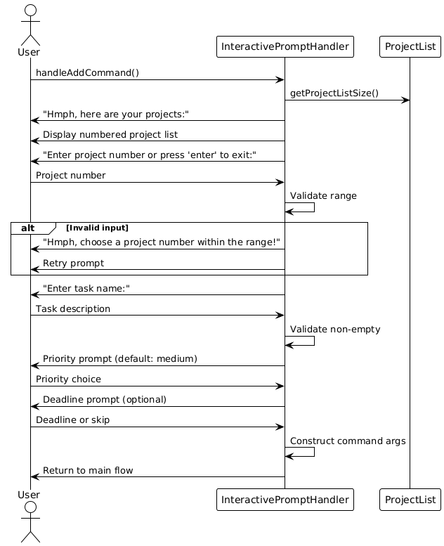
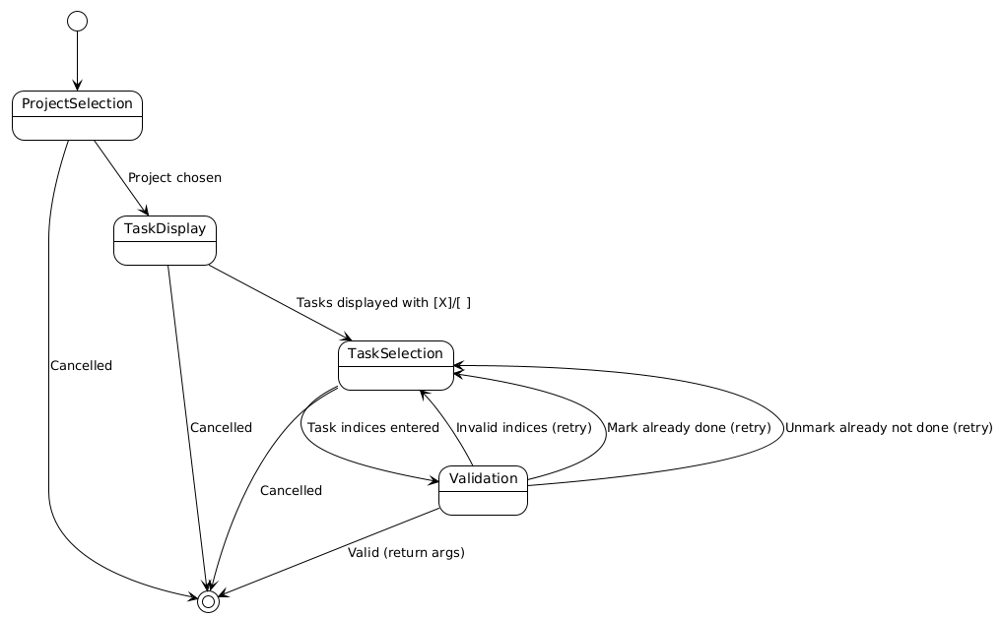

# Developer Guide

---

## Acknowledgements

{list here sources of all reused/adapted ideas, code, documentation, and third-party libraries -- include links to the original source as well}

---

## Table of Contents

- [Architecture](#architecture-yao-xiang)
- [Implementation &amp; Design](#implementation--design)
  - [Core Functionality](#core-functionality)
  - [Data Processing](#data-processing)
  - [Data Persistence](#data-persistence)
  - [User Interface](#user-interface)
    - [Interactive Mode](#interactive-mode-yao-xiang)
- [Product scope](#product-scope)
- [User Stories](#user-stories)
- [Non-Functional Requirements](#non-functional-requirements)
- [Glossary](#glossary)
- [Instructions for manual testing](#instructions-for-manual-testing)

---

## Architecture (Yao Xiang)

FlowCLI follows a layered architecture with clear separation of concerns:


**Key Design Principles:**

- **Single Responsibility**: Each class has one primary responsibility
- **Dependency Injection**: Components receive dependencies rather than creating them
- **Command Pattern**: All operations implemented as command objects
- **Layered Architecture**: UI → Logic → Model separation

---

## Implementation & Design

### Core Functionality

#### Task Management features by [Zing Jen](team/zingjen.md)

The task management system forms the core of FlowCLI, allowing users to create, track, and manage their work within different projects. The implementation follows the command pattern, where each user action is encapsulated in a dedicated command class.

##### `add-task` command

The `add-task` command allows users to add a new task to a specified project. Users can provide a task description, an optional deadline, and an optional priority.

**Command format**: `add-task <projectIndex> <description> [--priority <level>] [--deadline <YYYY-MM-DD>]`

The following sequence diagram illustrates the process of adding a task:


**Implementation Details**:

1.  The `CommandParser` identifies the `add-task` command and creates an `AddCommand` object.
2.  `AddCommand#execute()` is called.
3.  The command parses the arguments to extract the project index, task description, deadline, and priority.
4.  It validates that the project exists and that a task description is provided.
5.  If validation passes, it retrieves the `Project` object and calls `project.addTask()` to create and add the new task.
6.  The `ConsoleUi` then displays a confirmation message to the user.

---

##### `delete-task` command

The `delete-task` command is used to remove a task from a project. It requires the project index and the 1-based index of the task to be deleted.

**Command format**: `delete-task <projectIndex> <taskIndex>`

The sequence diagram below shows the workflow:


**Implementation Details**:

1.  The `CommandParser` creates a `DeleteTaskCommand` object.
2.  `DeleteTaskCommand#execute()` validates the presence of the project index and task index.
3.  It ensures the specified project exists and the task index is within the valid range.
4.  If valid, it calls `project.deleteTask()` to remove the task from the project's `TaskList`.
5.  A success message, including the details of the deleted task, is shown to the user.

---

##### `mark` and `unmark` commands

These commands allow users to change the completion status of a task.

- `mark`: Marks a task as done.
- `unmark`: Marks a task as not done.

**Command format**:

- `mark <projectIndex> <taskIndex>`
- `unmark <projectIndex> <taskIndex>`

The process is illustrated in the following diagram:


**Implementation Details**:

1.  `MarkCommand` or `UnmarkCommand` is instantiated by the parser.
2.  The `execute()` method validates the project and task index.
3.  It retrieves the `Task` object and calls its `mark()` or `unmark()` method.
4.  The command includes logic to prevent redundant operations (e.g., marking an already-marked task).
5.  The UI confirms that the task status has been updated.

---

##### `update-task` command

The `update-task` command modifies the attributes of an existing task, such as its description, deadline, or priority.

**Command format**: `update-task <projectIndex> <taskIndex> [--description <desc>] [--deadline <YYYY-MM-DD|none>] [--priority <level>]`

The update process is shown below:


**Implementation Details**:

1.  The `UpdateCommand` is responsible for parsing the various optional flags that specify which fields to update.
2.  It validates the project and task index.
3.  It calls `project.updateTask()`, passing the new values. The `updateTask` method handles the logic of only changing the fields that were provided in the command.
4.  The UI displays the updated task details.

---

##### `list` command

The `list` command displays tasks. It can either list all tasks in all projects or list the tasks of a specific project.

**Command format**: `list --all` or `list <projectIndex>`

The diagram below illustrates the listing process:


**Implementation Details**:

1.  The `ListCommand` checks if a project index was provided.
2.  If a project index is given, it finds the project and calls `ConsoleUi` to display only the tasks for that project.
3.  If no project name is given, it iterates through the entire `ProjectList` and instructs the `ConsoleUi` to display all projects and their associated tasks.

#### Project Management features by [Xylon Chan](team/xylonchan.md)

##### CreateCommand

The `Create-project` command is facilitated by `ProjectList`and it is accessed by `CommandContext`. It extends `Command` with the feature of reading the user's project name input and creating a project entity.
Additionally , it implements the following operations:

- `ProjectList#getProject(String name)` - returns the project if it exists, or `null` if not found.
- `ProjectList#addProject(String name)` - adds a new project with the given name.
- `ConsoleUi#showAddedProject()` - notifies the user after successful creation.
- `CommandContext#getProjects()` - returns all the projects currently in the ProjectList

Given below is an example usage scenario and how the `create-project` feature behaves at each step

**User Input**: The user enters the `create-project` command with the project name (e.g., `create-project Alpha`).

**Parsing**: The CommandParser identifies the command as `create-project` and constructs a CreateCommand with the raw arguments.

**Execution**: The FlowCLI main loop invokes CreateCommand#execute(CommandContext). (Note: CreateCommand extends Command.)

**Argument Parsing**: Inside execute, CreateCommand extracts the project name from the arguments

**Validation**: The command validates that the name is non-blank; if blank, it throws `MissingArgumentException`. It then checks duplicates via `context.getProjects().getProject(name)` if present, it throws `ProjectAlreadyExistsException`.

**Creating the Project**: On success, the command calls `context.getProjects().addProject(name)` to persist the new project in the model.

**UI Feedback**: The command obtains the UI via context.getUi() and calls showAddedProject() (or the equivalent success method) to confirm creation to the user.

**Return/Logging**: The command returns true to signal success and logs at info/fine levels; failures log at warning and do not mutate the model.

Here is a sequence diagram illustrating the process:


#### Common Classes

##### Project and ProjectList classes


#### Project class

##### Overview

Represents a single project and encapsulates its name and task collection `TaskList`. Allows for adding/updatig/deleting tasks within a project without directly coordinating multiple lower-level classes.

##### Requirements

`projectName` is non null and should be non-blank when constructed
`projectTasks` is non null after construction

##### Helping classes

- `TaskList` and `Task` (for managing per-project tasks).

-`ProjectList (container)` creates and returns Project instances.

##### API

- `Project(String projectName)` — Constructor that constructs an empty project with the given name.

- `String getProjectName()` — returns the name of the project.

- `TaskList getProjectTasks()` — returns the tasks in that project

- `void addTask(String description)` — adds a task.

- `void addTask(String description, LocalDate deadline, int priority)` — add a task with deadline and priority

- `Task deleteTask(int index) — remove and return the task at index.`

- `Task updateTask(int index, String newDescription, boolean updateDescription, LocalDate newDeadline, boolean updateDeadline, Integer newPriority, boolean updatePriority)` — Updates the task description , deadline and priority

- `String showAllTasks()` — render the project’s tasks to a printable string (delegates to `TaskList.render()`).

- `String toString()` — printable representation of the project header + rendered tasks.

#### ProjectList class

##### Overview

An ArrayList container of Project instances offering indexed access, name-lookup, and simple rendering. This is the central point for commands to manipuate the collection of projects (e.g., create-project, delete-project, list-projects).

##### Requirements

`projects` is non null after construction

##### Helping classes

- `Project` - element sotred in the list.

##### API

- `void addProject(String projectName)` — appends a new Project.

- `Project delete(int zeroBasedIndex)` — delete by index, return the removed Project for confirmation.

- `Project deleteProject(Project project)` — remove by identity and returns the removed project

- `Project getProjectByIndex(int zeroBasedIndex)` — indexed accessor.

- `List<Project> getProjectList()` — list the projects by name currently in the list

- `int getProjectListSize()` — returns the number of projects.

- `Project getProject(String projectName)` — returns the project via name-based lookup

- `String render()` — concatenate each project’s toString() into a printable block.

### Data Processing

#### Task Sorting Algorithm (Yao Xiang)

The sorting algorithm supports sorting tasks by deadline or priority in ascending/descending order:


**Algorithm Details:**

- **Time Complexity**: O(n log n) using Java's built-in sort
- **Space Complexity**: O(n) for task list copy
- **Deadline Handling**: Tasks without deadlines are sorted last in ascending order
- **Priority Mapping**: High(1) > Medium(2) > Low(3)

#### Task Filtering Algorithm (Yao Xiang)

The filtering algorithm supports filtering tasks by priority level and/or project name:


**Algorithm Details:**

- **Time Complexity**: O(n) linear scan through all tasks
- **Space Complexity**: O(m) where m is number of matching tasks
- **Case Insensitive**: Project name and priority filtering ignore case
- **Multiple Filters**: Can combine priority and project name filters

### Data Persistence

Export: Export current project and task data to a file.

### **User Interface**

### Interactive Mode (Yao Xiang)


#### Implementation Overview

The interactive mode transforms single-word commands into guided conversations. When a user types "add" without arguments, the system prompts for project selection, task details, and optional fields.

#### Class Diagram: InteractivePromptHandler Structure (Yao Xiang)


#### Interactive Mode Detection (Yao Xiang)

The `CommandHandler.shouldUseInteractiveMode()` method determines when to trigger interactive mode:

```java
private boolean shouldUseInteractiveMode(CommandParser.ParsedCommand parsed) {
    switch (parsed.getType()) {
    case ADD_TASK:
        return parsed.getArguments().trim().isEmpty();
    case CREATE_PROJECT:
        return parsed.getArguments().trim().isEmpty();
    case LIST:
        return parsed.getArguments().trim().isEmpty();
    case MARK:
        return parsed.getArguments().trim().isEmpty();
    case UNMARK:
        return parsed.getArguments().trim().isEmpty();
    case DELETE:
        return parsed.getArguments().trim().isEmpty();
    case UPDATE:
        return parsed.getArguments().trim().isEmpty();
    case SORT:
        return parsed.getArguments().trim().isEmpty();
    case FILTER:
        return parsed.getArguments().trim().isEmpty();
    case EXPORT:
        return parsed.getArguments().trim().isEmpty();
    case STATUS:
        return parsed.getArguments().trim().isEmpty();
    default:
        return false;
    }
}
```

**Decision Rationale**: Interactive mode is triggered for main commands with empty arguments, preserving backward compatibility.

#### Task Status Display System (Zhen Zhao)

Tasks display completion status using visual markers:

```java
public String marker() {
    return isDone ? "[X]" : "[ ]";
}

public String toString() {
    StringBuilder sb = new StringBuilder();
    sb.append(marker()).append(" ").append(description);
    if (deadline != null) {
        sb.append(" (Due: ").append(deadline).append(")");
    }
    sb.append(" [").append(getPriorityString()).append("]");
    return sb.toString();
}
```

**Display Example**:

```
1. [X] Implement login feature (Due: Dec 31, 2024) [high]
2. [ ] Write unit tests [medium]
3. [ ] Fix bug in parser [low]
```

#### Interactive Command Flows (Yao Xiang)

#### Add Command Flow (Yao Xiang)

The add command guides users through project selection, task description, priority, and optional deadline:



**Key Features**:

- Project validation with range checking
- Required task description with empty string rejection
- Optional priority (defaults to "medium")
- Optional deadline with YYYY-MM-DD format validation

#### Add Command State Flow (Yao Xiang)


**Optional Fields**: Priority and deadline can be skipped, defaulting to "medium" and no deadline respectively.

#### Mark/Unmark Command Flows (Yao Xiang)

Mark and unmark commands share similar logic but with different validation:

```java
public String handleMarkCommand() {
    Integer projectSelection = promptForProjectIndex();
    if (projectSelection == null) return null;

    // Display tasks with status markers
    System.out.println("Hmph, which tasks do you want to mark as done in " + projectName + ":");
    for (int i = 0; i < project.size(); i++) {
        var task = project.getProjectTasks().get(i);
        String status = task.isDone() ? "x" : " ";
        System.out.println((i + 1) + ". [" + status + "] " + task.getDescription());
    }

    // Multiple task selection with comma separation
    String input = scanner.nextLine().trim();
    String[] indices = input.split(",");
    // ... validation and construction
}
```

**Mark vs Unmark Validation**:

- **Mark**: Prevents marking already completed tasks
- **Unmark**: Prevents unmarking already incomplete tasks
- **Error Message**: "Your task is not even marked, what do you want me to unmark!"

#### Delete Command Flow (Yao Xiang)

Delete command uses a two-stage approach: type selection then specific item selection with confirmation:


**Safety Features**:

- Confirmation prompts for all destructive operations
- Clear project/task listing before selection
- Case-insensitive confirmation ("y", "yes", "n", "no")

#### Update Command Flow (Yao Xiang)

Update command implements recursive field updates allowing multiple changes in one session:


**Recursive Design**: Users can update multiple fields without restarting the flow, with options to reselect tasks/projects or exit at any point.

#### Export Command Flow (Yao Xiang)

The export command provides comprehensive data export capabilities with multiple filtering and sorting options. Users can export their project and task data in various formats and configurations.

**Key Features:**

- **Multiple Export Types**: All tasks, specific projects, filtered tasks, sorted tasks, or combined filtered and sorted exports
- **Flexible Output**: Supports various file formats (typically CSV or JSON)
- **Data Filtering**: Can filter by project name, priority levels, or completion status
- **Data Sorting**: Can sort by deadline, priority, or other task attributes
- **File Naming**: Custom filename specification for organized data management

**Export Options:**

1. **All Tasks**: Exports every task across all projects
2. **Specific Project**: Exports only tasks from a selected project
3. **Filtered Tasks**: Exports tasks matching specific criteria (priority, project, status)
4. **Sorted Tasks**: Exports tasks in sorted order (by deadline, priority, etc.)
5. **Filtered and Sorted**: Combines filtering and sorting for precise data extraction


#### Create Command Flow (Yao Xiang)

Create command prompts for a new project name with validation:


**Validation**: Checks for empty names and duplicate project names.

#### Mark/Unmark Command Flows (Yao Xiang)

Mark and unmark commands follow identical selection flow with different validation:



**Shared Logic**: Both commands use identical project/task selection but different validation rules.

#### Sort Command Flow (Yao Xiang)

Sort command offers field and order selection:


**Simple Flow**: Two sequential choices with no complex validation.

#### Filter Command Flow (Yao Xiang)

Filter command offers priority level selection:


**Single Choice**: Simple selection from three priority options.

#### List Command Flow (Yao Xiang)


**Display Logic**: Shows numbered project list, then either displays tasks for selected project or all projects with all tasks.

#### Status Command Flow (Yao Xiang)


**Status Types**: Shows either project-level statistics or task completion summaries.

## Product scope

---

### Target user profile

Individual student developers working on their own coursework, capstones, hackathons, or any other related projects that require task management to streamline their workflow.

---

### Value proposition

FlowCLI addresses the challenge of managing complex academic or personal projects by providing a streamlined, command-line interface for task and project organization. It helps student developers maintain focus, track progress, and efficiently handle multiple assignments or project phases without the overhead of graphical user interfaces. By offering quick task creation, flexible filtering, and clear status overviews, FlowCLI ensures that users can dedicate more time to coding and less to administrative overhead, ultimately boosting productivity and reducing stress.

---

## User Stories

| Version | As a ... | I want to ...                               | So that I can ...                                           |
| ------- | -------- | ------------------------------------------- | ----------------------------------------------------------- |
| v1.0    | new user | see usage instructions                      | refer to them when I forget how to use the application      |
| v1.0    | user     | find a to-do item by name                   | locate a to-do without having to go through the entire list |
| v1.0    | user     | create and manage projects and tasks        | organize my work and track progress efficiently             |
| v1.0    | user     | add, mark, unmark, delete, and update tasks | keep my task list accurate and up-to-date                   |
| v1.0    | user     | view, filter, and sort tasks                | focus on relevant tasks and prioritize my workload          |
| v1.0    | user     | export my tasks                             | backup my data or share it with others                      |
| v2.0    | user     | use interactive prompting for commands      | be guided through complex commands easily                   |
| v2.0    | user     | check the status of my projects and tasks   | get a quick overview of my progress and workload            |

---

## Non-Functional Requirements

- **Performance**: The CLI should respond to commands within 1 second for typical operations (e.g., adding a task, listing tasks in a project with up to 100 tasks).
- **Reliability**: Task and project data must be persisted reliably across sessions. Data corruption should be prevented under normal operating conditions.
- **Usability**: The CLI should be intuitive for users familiar with command-line interfaces, with clear command formats and helpful error messages.
- **Maintainability**: The codebase should be well-structured, documented, and adhere to established coding standards to facilitate future enhancements and bug fixes.
- **Portability**: The application should run on major operating systems (Windows, macOS, Linux) where Java is supported.
- **Scalability**: The application should efficiently handle up to 100 projects, each containing up to 500 tasks, without significant performance degradation.
- **Security**: Sensitive user data (if any, though currently none is stored) should be protected against unauthorized access or modification.

---

## Glossary

- **CLI (Command-Line Interface)** - A text-based interface used to operate software and operating systems.
- **Task** - A unit of work within a project, often with a description, deadline, and priority.
- **Project** - A collection of related tasks, representing a larger initiative or goal.
- **Interactive Mode** - A mode of operation where the CLI guides the user through command inputs with prompts.
- **Command Pattern** - A behavioral design pattern in which an object is used to encapsulate all information needed to perform an action or trigger an event at a later time.
- **NFR (Non-Functional Requirement)** - Requirements that specify criteria that can be used to judge the operation of a system, rather than specific behaviors (e.g., performance, reliability, usability).

## Instructions for manual testing

1.  **Prerequisites**: Ensure you have Java Development Kit (JDK) 11 or later installed.
2.  **Build the application**: Navigate to the project root directory in your terminal and run `./gradlew shadowJar` (on Unix-like systems) or `gradlew.bat shadowJar` (on Windows). This will compile the application and create an executable JAR file in the `build/libs` directory.
3.  **Run the application**: Execute the JAR file using `java -jar build/libs/FlowCLI.jar`.
4.  **Loading sample data**: The application starts with an empty state. To test with sample data, you can manually input commands to create projects and tasks. For example:
    - `create-project MyCapstone`
    - `add-task 1 "Implement login feature" --deadline 2025-12-31 --priority high`
    - `add-task 1 "Write unit tests" --priority medium`
    - `create-project ResearchPaper`
    - `add-task 2 "Literature review" --deadline 2025-11-15`
5.  **Test Inline Commands**: Execute commands with all arguments provided on a single line.
    - **Example (Add Task)**: `add-task 1 "Implement login feature" --deadline 2025-12-31 --priority high`
    - **Example (Create Project)**: `create-project MyNewProject`
    - **Example (List Tasks)**: `list --all`
    - Experiment with all other commands: `mark`, `unmark`, `delete-task`, `update-task`, `delete-project`, `sort`, `filter`, `status`, and `export` using their full inline syntax.
6.  **Test Interactive Mode**: Trigger interactive mode by typing a command keyword without any arguments, then follow the prompts.
    - **Example (Add Task)**: Type `add-task` and press Enter. The CLI will then prompt you for the project index, description, deadline, and priority.
    - **Example (Create Project)**: Type `create-project` and press Enter. The CLI will prompt you for the project name.
    - Experiment with other commands that support interactive mode (e.g., `list`, `mark`, `unmark`, `delete-task`, `update-task`, `sort`, `filter`, `status`, `export`) by typing the command name alone.
7.  **Test edge cases**: Try invalid inputs, out-of-range indices, duplicate project names, and missing arguments to observe error handling.
8.  **Verify data persistence**: Exit the application using `bye`, then restart it. Verify that all previously added projects and tasks are still present.
9.  **Export and verify**: Use the `export` command to export data and manually check the generated file's content and format.
