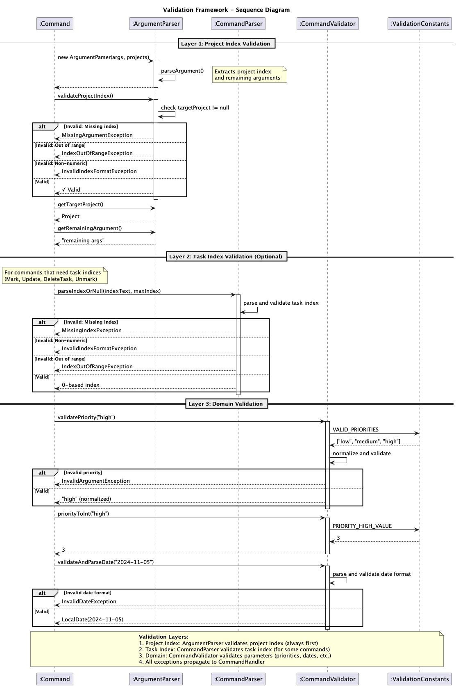
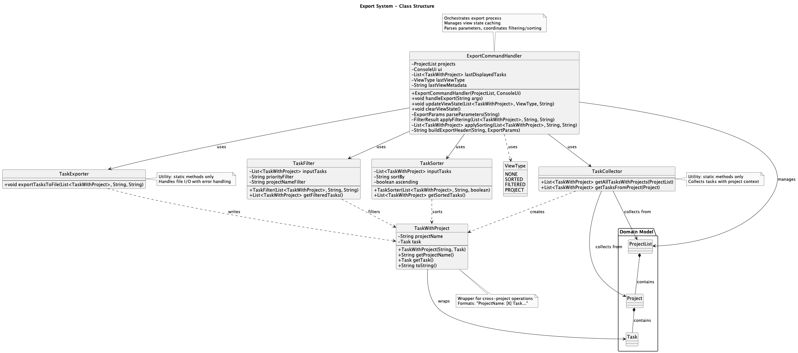
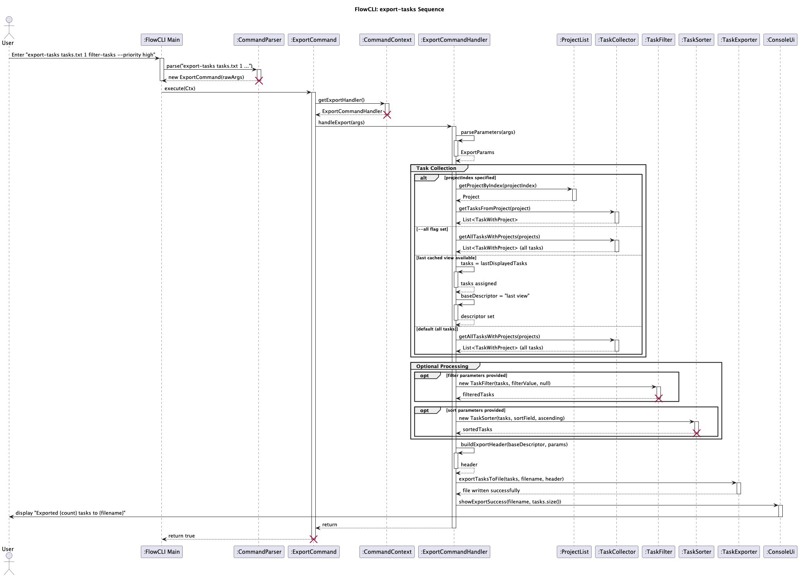

# Sean Lee - Project Portfolio Page

## Overview
FlowCLI is a keyboard-first task and project manager built for speed. Create projects and track tasks with priorities, deadlines, and completion states, then slice the list instantly with filtering and sorting. Use concise inline commands when you know exactly what you want, or switch to interactive prompts for a guided flow. When you’re done, export a clean text report for sharing or record‑keeping.

## Summary of Contributions

### Code contributed

[RepoSense link](https://nus-cs2113-ay2526s1.github.io/tp-dashboard/?search=sean6369&breakdown=true&sort=groupTitle%20dsc&sortWithin=title&since=2025-09-19T00:00:00&timeframe=commit&mergegroup=&groupSelect=groupByRepos&checkedFileTypes=docs~functional-code~test-code~other&filteredFileName=)

### Enhancements implemented

**1. Export infrastructure and view-state design**

**What it does**: Core export infrastructure (`TaskWithProject`, `TaskCollector`, `TaskExporter`) with cross-platform filename validation and I/O error handling. Legacy prototype (`LegacyExportSupport`) demonstrated view-state awareness.

**Justification**: Export requires cross-project aggregation, consistent formatting, and robust error handling. Early validation prevents partial runs; prototype validated exporting last displayed list.

**Highlights**: 
1. `TaskWithProject` associates tasks with project names; `TaskCollector` with `getAllTasksWithProjects()` and `getTasksFromProject()`
2. `TaskExporter` handles error scenarios with actionable messages; `isValidFilename()` validates illegal chars; `.txt` extension enforced in `ExportCommandHandler`
3. `LegacyExportSupport` prototype with chained filter/sort and view-state tracking; core infrastructure used by `ExportCommandHandler`; view-state enables smart defaults

**Code**: `TaskWithProject`, `TaskCollector`, `TaskExporter`, `ExportCommandHandler`, `LegacyExportSupport`

**2. Command validation utilities**

**What it does**: Centralized validation framework (`CommandValidator`, `ValidationConstants`) and index parsing/validation (`parseIndexOrNull`, `validateProjectIndex`), eliminating duplication.

**Justification**: Scattered validation logic with inconsistent rules. Centralization ensures DRY, consistency, and easier maintenance.

**Highlights**: 
1. Validation methods for priorities, dates, filters, and sort options
2. `parseIndexOrNull()` and `validateProjectIndex()` for index parsing with format/range checks
3. `ValidationConstants` centralizes valid values; `priorityToInt()` normalizes priorities
4. Integrated across all commands and interactive prompts

**Code**: `CommandValidator`, `ValidationConstants`

**3. Error handling and custom exceptions**

**What it does**: Implemented 6 specific exception classes in an exception hierarchy (all extend `FlowCLIException`). `InvalidCommandSyntaxException` refactored syntax errors from `InvalidArgumentException` (structure vs values).

**Justification**: Specific exceptions improve error boundaries, testability, and precise messages. Textual feedback quality impacts CLI UX.

**Highlights**: 
1. `InvalidCommandSyntaxException` for syntax errors; domain-specific exceptions for dates, filenames, indices, and extra arguments
2. Context-aware constructors provide detailed error messages with auto-generated formats and type information
3. Enhanced `IndexOutOfRangeException` distinguishes task vs project indices; integrated across all validation flows

**Code**: `seedu.flowcli.exceptions`

### Contributions to the User Guide (UG)

1. **Export tasks section**: Authored comprehensive documentation covering export behavior with `--all` flag, project-specific exports, filter/sort combinations, and smart defaults (cached view export). Included detailed examples, file format specifications, path handling guidance, and interactive mode options.
2. **Common mistakes and fixes**: Added troubleshooting blocks under `add-task`, `update-task`, `sort-tasks`, `filter-tasks`, and `export-tasks` commands. Each block provides specific error messages with actionable solutions (e.g., "Invalid filename" → "Avoid illegal characters and ensure the name ends with `.txt`", "Export failed: Permission denied" → "Export to a writable location").
3. **Error handling guidance**: Documented export-related error scenarios including directory not found, permission denied, filesystem errors, and file locking issues, with clear remediation steps for each case.

### Contributions to the Developer Guide (DG)

1. **Validation Framework subsection**: Authored comprehensive documentation covering centralized input validation architecture. Documented `CommandValidator` methods, `ValidationConstants` structure, parser integration (`parseIndexOrNull`, `validateProjectIndex`), exception hierarchy, 3-layer validation flow, and best practices. Included usage examples, sequence diagram, and exception type reference.
2. **Export Algorithm section**: Documented export infrastructure with architecture overview, key components (`ExportCommandHandler`, `TaskCollector`, `TaskExporter`, `TaskWithProject`), design principles, export workflow (5-step process), and integration details. Included class and sequence diagrams, code examples showing view state caching, and file format specifications.

### Contributions to team-based tasks

1. **Export UX design**: Designed the user experience flow for `export-tasks` command including interactive mode prompts, parameter collection sequence, confirmation dialogs, and success message formatting. Ensured seamless integration with existing sort/filter commands through view-state caching.
2. **Error handling framework**: Established comprehensive error handling standards across the codebase. Defined exception hierarchy, error message conventions, and validation patterns that were adopted by team members. Supported bug triage by categorizing error types and providing clear remediation paths.
3. **Validation framework adoption**: Created the centralized validation framework (`CommandValidator`, `ValidationConstants`) that became the standard for all command implementations, reducing code duplication and ensuring consistent validation behavior across the project.
4. **Documentation standards**: Contributed to establishing documentation standards for the Developer Guide, particularly around validation framework and export algorithm sections, ensuring consistent formatting and completeness.

### Review/mentoring contributions

1. **Code review focus**: Actively reviewed PRs related to command parsing, validation logic, and error handling implementations. Provided feedback on exception usage, validation patterns, and error message consistency to maintain CLI output quality.
2. **Architecture guidance**: Mentored team members on using the validation framework (`CommandValidator`, `parseIndexOrNull`, `validateProjectIndex`) and exception hierarchy, helping them adopt consistent patterns in their implementations.
3. **UX consistency**: Reviewed and provided feedback on sorting/filtering command implementations to ensure seamless integration with export functionality, maintaining a coherent user experience across cross-project operations.
4. **Error message standards**: Reviewed command implementations to ensure error messages followed established patterns (actionable, context-aware, user-friendly), contributing to overall CLI usability.

### Contributions beyond the project team

1. **PR and commit message standardization**: Established comprehensive PR description templates and commit message conventions across the team. Defined structure for PRs (description, changes, testing, related issues) and commit message format (type, scope, description) to improve review efficiency and project traceability.
2. **Validation patterns**: The centralized validation framework and exception hierarchy design patterns could serve as reference implementations for other CLI projects requiring robust input validation.
3. **Documentation practices**: The validation framework documentation structure and export algorithm documentation approach could be adopted by other teams for similar feature documentation.

---

## Contributions to the Developer Guide (Extracts)

The following are extracts from the `DeveloperGuide.md` that I contributed to.

### Validation Framework

The validation framework provides centralized input validation across all commands, ensuring consistent error handling and user feedback.

**Architecture Overview:**

The validation framework operates in 3 main layers:

1. **Project Index layer**: `ArgumentParser.validateProjectIndex()` validates project index format and range (throws `MissingArgumentException`, `IndexOutOfRangeException`, `InvalidIndexFormatException`) - *always executed first*
2. **Task Index layer**: `CommandParser.parseIndexOrNull()` validates task index format and range (throws `MissingIndexException`, `InvalidIndexFormatException`, `IndexOutOfRangeException`) - *only for commands that need task indices (Mark, Update, DeleteTask, Unmark)*
3. **Domain layer**: Commands use `CommandValidator` methods for domain-specific validation (priorities, dates, filters, sort options) which reference `ValidationConstants` for valid values

**Exception Types:**

1. `InvalidIndexFormatException` - Index cannot be parsed as integer
2. `InvalidDateException` - Date format is invalid (expects `yyyy-MM-dd`)
3. `InvalidFilenameException` - Filename format is invalid
4. `InvalidCommandSyntaxException` - Command syntax is malformed or incomplete
5. `ExtraArgumentException` - Unexpected extra parameters provided to commands

**Validation Flow:**

The following sequence diagram illustrates the validation process, showing both success and exception paths:



**Best Practices:**

1. Always validate project index first using `ArgumentParser.validateProjectIndex()` before accessing project data
2. Validate optional parameters (priority, deadline) before using them
3. Use `validatePriority()` followed by `priorityToInt()` to normalize and convert priorities
4. Throw specific exception types rather than generic ones for better error messages

### Export Algorithm

The export algorithm supports saving project and task data to text files with filtering and sorting capabilities.

**Architecture Overview:**



**Key Components:**

1. **ExportCommandHandler** - Orchestrates export process, parameter parsing, and view state management
2. **TaskCollector** - Utility class for aggregating tasks from projects with project context
3. **TaskExporter** - Utility class for file I/O operations with comprehensive error handling
4. **TaskWithProject** - Wrapper class enabling cross-project operations

**Export Workflow:**

The following sequence diagram illustrates the export workflow:



**TaskExporter:**

Utility class that writes tasks to text files with comprehensive error handling:

**Method:** `exportTasksToFile(List<TaskWithProject> tasks, String filename, String header) throws FileWriteException`

Uses try-with-resources for automatic cleanup. All I/O exceptions are translated to `FileWriteException` with user-friendly messages covering: permission denied, directory not found, disk space issues, file locking, path length limits, read-only filesystem, and security policy violations. Error messages follow the pattern `"'<filename>': <description>"` with actionable suggestions.

**Integration with ExportCommandHandler:**

The export workflow consists of 5 steps:

1. **Parameter Parsing** - Validates filename, project selection, filters, and sorting options
2. **Task Collection** - Uses `TaskCollector` based on parameters with 4 strategies (all tasks, specific project, cached view, or default)
3. **Filtering/Sorting** - Applies `TaskFilter` and `TaskSorter` if specified in export command
4. **File Export** - Calls `TaskExporter.exportTasksToFile()` with header
5. **User Feedback** - Displays success via `ConsoleUi.showExportSuccess()`

---

## Contributions to the User Guide (Extracts)

The following are extracts from the `UserGuide.md` that I contributed to.

### Export tasks Command

Saves tasks to a plain-text file with flexible export options.

**Export behavior:**

1. **With `--all` flag**: Always exports all tasks from all projects
   ```
   export-tasks all-tasks.txt --all
   ```
2. **With project index**: Exports only tasks from the specified project
   ```
   export-tasks party-plan.txt 1
   ```
3. **With filter/sort in command**: Exports tasks matching the specified criteria
   ```
   export-tasks high-priority.txt filter-tasks --priority high sort-tasks --deadline ascending
   ```
4. **Without parameters (smart defaults)**:
   - If you previously ran `sort-tasks` or `filter-tasks`, exports that cached view
   - If no cached view exists (or you used `list` command), exports all tasks
   - To force exporting all tasks, use the `--all` flag

**Common mistakes and fixes:**

1. **"Export failed: Directory does not exist"**: Create the folder or use an existing path.
2. **"Export failed: Permission denied"**: Export to a writable location (e.g., home directory).
3. **"No tasks to export"**: Broaden scope by removing filters or exporting all tasks.
4. **"Invalid filename"**: Filename must end with `.txt` and cannot contain invalid characters (`< > : " / \ | ? *`).

**Export file format example:**

When you export tasks, FlowCLI creates a plain text file like this:

```
Exported tasks (filter by priority high, sort by deadline ascending)
========================================

Project1: [X] Complete feature implementation (Due: 2025-11-15) [high]
Project1: [ ] Write documentation (Due: 2025-11-20) [high]
Project2: [ ] Review code (Due: 2025-11-18) [high]
```

### Common Mistakes and Fixes Sections

Added troubleshooting blocks throughout the User Guide to help users quickly resolve common errors:

**Export-related errors:**
1. Export failed: Permission denied
2. Export failed: Directory does not exist
3. Export failed due to filesystem error (read-only, disk full, etc.)
4. File is currently open or locked

**Validation errors:**
1. Invalid date format (must be `YYYY-MM-DD`)
2. Invalid priority value (must be `low`, `medium`, or `high`)
3. Invalid index format
4. Unexpected extra parameters

Each error includes specific causes and actionable solutions to help users resolve issues independently.
