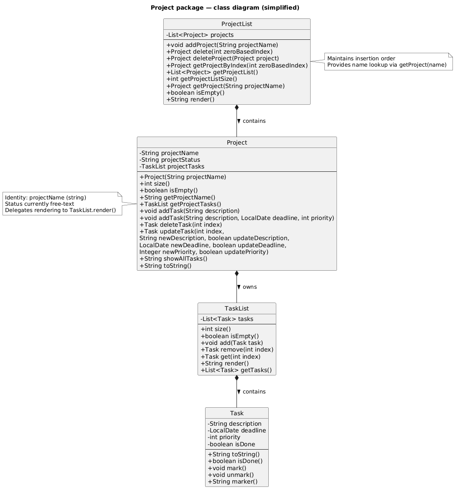

# Xylon Chan - Project Portfolio Page

## Overview
FlowCLI is a command-line app for managing tasks and projects, built for speed and full keyboard control. Track priorities, deadlines, and statuses, filter and sort in an instant, then export your current view to TXT. If you type fast, FlowCLI helps you move faster than click-heavy apps.

### Summary of Contributions

### Code contributed 
[My contributions](https://nus-cs2113-ay2526s1.github.io/tp-dashboard/?search=&sort=groupTitle&sortWithin=title&timeframe=commit&mergegroup=&groupSelect=groupByRepos&breakdown=true&checkedFileTypes=docs~functional-code~test-code~other&since=2025-09-19T00%3A00%3A00&filteredFileName=&tabOpen=true&tabType=authorship&tabAuthor=xylonc&tabRepo=AY2526S1-CS2113-W13-2%2Ftp%5Bmaster%5D&authorshipIsMergeGroup=false&authorshipFileTypes=docs~functional-code~test-code&authorshipIsBinaryFileTypeChecked=false&authorshipIsIgnoredFilesChecked=false)

### Enhancements implemented 

#### Project Management implementation 

##### Summary 
The project management component managed all project-related functionality in FlowCLI. They define how projects are created, stored, retrieved, and displayed within the application. Key classes handle the project list, individual project objects, and persistence of project data. 

##### Example 
The `Create-project` command class enables users to add new projects through the CLI by parsing user input, validating project names, checking for duplicates, and updating the project list accordingly. Together, these components form the backbone of project creation and management in FlowCLI.

##### Testing of code 
Contributed to the maintainance as well as the testing of the commands and new features at every stage of the app development. Using concepts learnt in class like assertions , logging and design test cases , created Junit tests to ensure the code work the way it was intended do 

##### Contributions to the User Guide (UG)
- Updated the parts relevant to the additions I added, ensured that the user will have a easy time reading, understanding and implementing the code in our project.
- Also helped read the parts of my teammates and ensured our explanations aligned while also ensuring that the UG is cohesive when read as a whole

##### Contributions to the Developer Guide (DG) 
- Added the section on project management in the DG where it explains how that component function.
- Elaborated by explaining the feature of CreateCommand and how it works as well as using a diagram to explain how the component works and the classes involved 
- Helped to read through and ensure the parts were cohesive 

##### Contributions to team-based tasks
- Helped to drive and facilitate discussion during group calls, enusring everyone had an opportunity to voice their opinions and concerns when brainstorming 
- Led the brainstroming of the app we as a group wanted to create, actively encouraging my teammates to run through their ideas and concerns during the planning stage
- Hosted weekly calls with the group and found the times that best suited everyone

##### Contributions beyond the team project
- Actively volunteer to submit group submissions during the tutorials, actively ensuring everyone was involved and had a chance to participate 
- Actively participated and fostered a condusive environment during tutorials for discussion and learning of new concepts.

##### Contributions to the Developer Guide (Extracts)
#### Project Management features by [Xylon Chan](./xylonc.md)

##### CreateCommand

The `Create-project` command is facilitated by `ProjectList`and it is accessed by `CommandContext`. It extends `Command` with the feature of reading the user's project name input and creating a project entity.
Additionally , it implements the following operations:

- `ProjectList#getProject(String name)` - returns the project if it exists, or `null` if not found.
- `ProjectList#addProject(String name)` - adds a new project with the given name.
- `ConsoleUi#showAddedProject()` - notifies the user after successful creation.
- `CommandContext#getProjects()` - returns all the projects currently in the ProjectList

Given below is an example usage scenario and how the `create-project` feature behaves at each step

**User Input**: The user enters the `create-project` command with the project name (e.g., `create-project Alpha`).

**Parsing**: The CommandParser identifies the command as `create-project` and constructs a CreateCommand with the raw arguments.

**Execution**: The FlowCLI main loop invokes CreateCommand#execute(CommandContext). (Note: CreateCommand extends Command.)

**Argument Parsing**: Inside execute, CreateCommand extracts the project name from the arguments

**Validation**: The command validates that the name is non-blank; if blank, it throws `MissingArgumentException`. It then checks duplicates via `context.getProjects().getProject(name)` if present, it throws `ProjectAlreadyExistsException`.

**Creating the Project**: On success, the command calls `context.getProjects().addProject(name)` to persist the new project in the model.

**UI Feedback**: The command obtains the UI via context.getUi() and calls showAddedProject() (or the equivalent success method) to confirm creation to the user.

**Return/Logging**: The command returns true to signal success and logs at info/fine levels; failures log at warning and do not mutate the model.

Here is a sequence diagram illustrating the process:

##### Project, ProjectList, Task, and TaskList classes

**Class Relationships:**
- **ProjectList** contains multiple **Project** instances
- Each **Project** contains a **TaskList**
- Each **TaskList** contains multiple **Task** instances

This hierarchical structure allows for organized task management within distinct projects, with clear ownership and encapsulation of responsibilities.

#### Project class

##### Overview

Represents a single project and encapsulates its name and task collection `TaskList`. Allows for adding/updatig/deleting tasks within a project without directly coordinating multiple lower-level classes.

##### Requirements

`projectName` is non null and should be non-blank when constructed
`projectTasks` is non null after construction

##### Helping classes

- `TaskList` and `Task` (for managing per-project tasks).

-`ProjectList (container)` creates and returns Project instances.

##### API

- `Project(String projectName)` — Constructor that constructs an empty project with the given name.

- `String getProjectName()` — returns the name of the project.

- `TaskList getProjectTasks()` — returns the tasks in that project

- `void addTask(String description)` — adds a task.

- `void addTask(String description, LocalDate deadline, int priority)` — add a task with deadline and priority

- `Task deleteTask(int index) — remove and return the task at index.`

- `Task updateTask(int index, String newDescription, boolean updateDescription, LocalDate newDeadline, boolean updateDeadline, Integer newPriority, boolean updatePriority)` — Updates the task description , deadline and priority

- `String showAllTasks()` — render the project’s tasks to a printable string (delegates to `TaskList.render()`).

- `String toString()` — printable representation of the project header + rendered tasks.

#### ProjectList class

##### Overview

An ArrayList container of Project instances offering indexed access, name-lookup, and simple rendering. This is the central point for commands to manipuate the collection of projects (e.g., create-project, delete-project, list-projects).

##### Requirements

`projects` is non null after construction

##### Helping classes

- `Project` - element sotred in the list.

##### API

- `void addProject(String projectName)` — appends a new Project.

- `Project delete(int zeroBasedIndex)` — delete by index, return the removed Project for confirmation.

- `Project deleteProject(Project project)` — remove by identity and returns the removed project

- `Project getProjectByIndex(int zeroBasedIndex)` — indexed accessor.

- `List<Project> getProjectList()` — list the projects by name currently in the list

- `int getProjectListSize()` — returns the number of projects.

- `Project getProject(String projectName)` — returns the project via name-based lookup

- `String render()` — concatenate each project’s toString() into a printable block.

