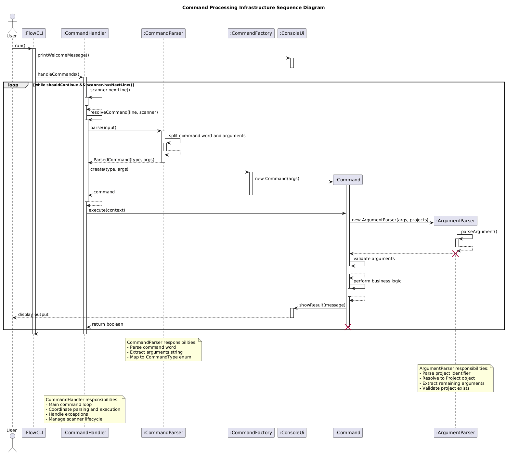
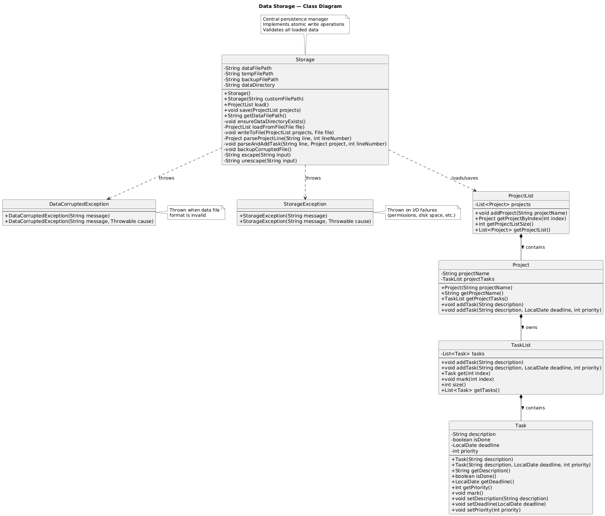

# Yang Zhenzhao - Project Portfolio Page

## Overview

FlowCLI is a CLI application for managing tasks and projects with keyboard-driven workflows. It supports inline commands and interactive mode for users. Users can track priorities, deadlines and statuses, filter and sort instantly, then export to TXT files.

I designed and implemented the core command processing infrastructure, project/task management systems, data persistence, and status display features.

## Summary of Contributions

### Code Contributed

[RepoSense Link](https://nus-cs2113-ay2526s1.github.io/tp-dashboard/?search=zhenzha0&breakdown=true&sort=groupTitle%20dsc&sortWithin=title&since=2025-09-19T00%3A00%3A00&timeframe=commit&mergegroup=&groupSelect=groupByRepos&checkedFileTypes=docs~functional-code~test-code~other&filteredFileName=)

### Enhancements Implemented

#### 1. Command Processing Infrastructure
Designed and implemented the core framework using Command pattern for parsing and executing user commands. Built `CommandHandler`, `CommandParser`, and `ArgumentParser` to enable clean separation of concerns and support both inline and interactive modes. This extensible architecture allows easy addition of new commands.
- [\[CommandHandler\]](../../src/main/java/seedu/flowcli/commands/core/CommandHandler.java) [\[CommandParser\]](../../src/main/java/seedu/flowcli/parsers/CommandParser.java) [\[ArgumentParser\]](../../src/main/java/seedu/flowcli/parsers/ArgumentParser.java)

#### 2. Core Data Models (Project and Task Management)
Implemented fundamental classes (`Project`, `ProjectList`, `Task`, `TaskList`) forming the data management backbone with encapsulation, validation, and comprehensive exception handling.
- [\[Project & ProjectList\]](../../src/main/java/seedu/flowcli/project/) [\[Task & TaskList\]](../../src/main/java/seedu/flowcli/task/)

#### 3. Status Display System
Built visual progress tracking with completion percentages, ASCII progress bars, and context-aware motivational messages. Uses `ProjectStatusAnalyzer` following single-responsibility principles.
- [\[StatusCommand\]](../../src/main/java/seedu/flowcli/commands/StatusCommand.java) [\[ProjectStatusAnalyzer\]](../../src/main/java/seedu/flowcli/commands/utility/ProjectStatusAnalyzer.java) [\[ConsoleUi\]](../../src/main/java/seedu/flowcli/ui/ConsoleUi.java)

#### 4. Data Persistence System
Implemented automatic save/load with atomic write operations (temp file + rename), data validation, special character escaping, corruption detection with backup, and retry logic. Handles edge cases: first-time runs, empty data, corrupted files, filesystem errors.
- [\[Storage\]](../../src/main/java/seedu/flowcli/storage/Storage.java) [\[Exceptions\]](../../src/main/java/seedu/flowcli/exceptions/) [\[FlowCLI integration\]](../../src/main/java/seedu/flowcli/FlowCLI.java) [\[ByeCommand integration\]](../../src/main/java/seedu/flowcli/commands/ByeCommand.java) [\[Tests\]](../../src/test/java/seedu/flowcli/storage/StorageTest.java)

#### 5. Exception Handling & Application Lifecycle
Created custom exception classes for meaningful error messages and implemented main application class coordinating all components.
- [\[Exception classes\]](../../src/main/java/seedu/flowcli/exceptions/) [\[FlowCLI\]](../../src/main/java/seedu/flowcli/FlowCLI.java) [\[ConsoleUi\]](../../src/main/java/seedu/flowcli/ui/ConsoleUi.java)

### Contributions to the User Guide
Data Persistence section • Common Workflows section • Troubleshooting section • Tips and Best Practices section • Export file format example

### Contributions to the Developer Guide
Command Processing Infrastructure (architecture + sequence diagram) • Status Display System (class diagram + execution flow) • Common Classes section • Data Storage (implementation details + class diagram + data format)

### Contributions to Team-Based Tasks
Set up project architecture and package structure • Designed command processing infrastructure for team use • Established code review standards • Configured GitHub Pages with `_config.yml` • Added documentation branding (cover images, logo)

### Review/Mentoring Contributions
Established foundational architecture and coding patterns as reference implementation for the team.

### Contributions Beyond the Project Team
[Bug reports](https://github.com/nus-cs2113-AY2526S1/ped-Zhenzha0/issues) submitted during PE-D

---

## Contributions to the Developer Guide (Extracts)

### Command Processing Infrastructure

The command processing infrastructure forms the backbone of FlowCLI's architecture, enabling efficient parsing and execution of user commands. This system consists of three main components:

**Architecture Overview:**

1. **CommandHandler**: Coordinates the command execution loop, managing the application's main control flow
2. **CommandParser**: Analyzes user input and creates appropriate Command objects based on the input string
3. **ArgumentParser**: Provides utility methods for extracting flags and arguments from command strings

**Design Rationale:**

The infrastructure follows the Command pattern, where each command encapsulates its own execution logic. This design:
- Enables easy addition of new commands without modifying existing code (Open-Closed Principle)
- Separates command parsing from execution (Single Responsibility Principle)
- Makes commands independently testable
- Supports both inline and interactive command modes through a unified interface

**Sequence Diagram:**

The following sequence diagram illustrates how a user command flows through the system:



**Implementation Details:**

The `ArgumentParser` class provides flag-based argument extraction, which all commands leverage for consistent input handling:

```java
public static String getArgumentForFlag(String input, String flag) 
        throws MissingArgumentException {
    // Extract argument following the specified flag
    // Throws exception if flag is present but argument is missing
}
```

---

### Status Display System

The status display system provides users with comprehensive project progress tracking, featuring completion percentages, visual progress bars, and context-aware motivational messages.

**Architecture Overview:**

The system separates concerns through two main components:
- **StatusCommand**: Handles user interaction and command routing
- **ProjectStatusAnalyzer**: Performs progress calculation and generates status data

**Class Diagram:**


**Execution Flow:**

When a user executes `status <projectIndex>` or `status --all`, the following sequence occurs:


**Implementation Details:**

The `ProjectStatusAnalyzer` calculates completion metrics:

```java
public static ProjectStatus analyzeProject(Project project) {
    int totalTasks = project.size();
    int completedTasks = 0;
    
    for (Task task : project.getProjectTasks().getTasks()) {
        if (task.isDone()) {
            completedTasks++;
        }
    }
    
    int percentage = (totalTasks == 0) ? 0 : (completedTasks * 100) / totalTasks;
    return new ProjectStatus(totalTasks, completedTasks, percentage);
}
```

**Display Features:**

1. **Progress Bar**: Visual representation using ASCII characters (`[=====>     ]` format with percentage)
2. **Completion Percentage**: Numerical progress indicator
3. **Motivational Messages**: Context-aware messages based on completion level:
   - ≤25%: "You are kinda cooked, start doing your tasks!"
   - ≤50%: "You gotta lock in and finish all tasks!"
   - ≤75%: "We are on the right track, keep completing your tasks!"
   - >75%: "We are finishing all tasks!! Upzzz!"

---

### Data Storage

The storage system provides persistent data storage for FlowCLI, automatically saving and loading all projects and tasks between sessions.

**Architecture Overview:**



**Key Components:**
- **Storage**: Main class handling file I/O, validation, and atomic write operations
- **DataCorruptedException**: Thrown when data file format is invalid
- **StorageException**: Thrown on I/O failures (permissions, disk space, etc.)

**Storage Location:** `./data/flowcli-data.txt`

**Data Format:**
```
PROJECT|Project Name
TASK|isDone|description|deadline|priority
```

**Implementation Highlights:**

1. **Atomic Writes**: Data is written to a temp file first, then renamed atomically to prevent corruption
2. **Data Validation**: All loaded data is validated; corrupted files are backed up and user warned
3. **Error Handling**: Retry logic for save failures; graceful degradation on load errors
4. **Edge Cases Handled**: First-time runs, empty data, corrupted files, filesystem errors

---

### Common Classes

The common classes form FlowCLI's core data model, providing robust project and task management capabilities.

**Class Overview:**

- **Project**: Represents a project containing multiple tasks, with methods for task CRUD operations
- **ProjectList**: Manages the collection of all projects with validation and search capabilities
- **Task**: Represents an individual task with description, priority, deadline, and completion status
- **TaskList**: Manages collections of tasks with validation and index-based access

**Design Principles:**

These classes follow object-oriented design principles:
- **Encapsulation**: Internal state is private with controlled access through methods
- **Validation**: All operations include input validation with meaningful exceptions
- **Immutability where appropriate**: Certain fields are final to prevent unintended modifications

**Example Usage:**

```java
// Creating a project with tasks
Project project = new Project("CS2113T Project");
Task task = new Task("Implement feature", Priority.HIGH, "2025-11-15");
project.addTask(task);

// Managing projects
ProjectList projects = new ProjectList();
projects.add(project);
Project retrieved = projects.getProjectByIndex(0);
```

---

## Contributions to the User Guide (Extracts)

### Common Workflows

Here are practical examples of how to combine commands for common use cases:

#### Daily Task Review
```bash
# Check what's urgent
filter-tasks --priority high
status --all

# Review and update a task
list 1
update-task 1 2 --deadline 2025-11-15
mark 1 1
```

#### Weekly Planning
```bash
# See all upcoming deadlines
sort-tasks --deadline ascending

# Export high-priority items for the week
export-tasks weekly-plan.txt filter-tasks --priority high sort-tasks --deadline ascending
```

#### Project Cleanup
```bash
# Check project status
status --all

# Mark completed tasks
mark 1 1
mark 1 3

# Remove finished tasks
delete-task 1 1
```

---

### Tips and Best Practices

#### Workflow Optimization
- **Start each session fresh**: Use `list --all` to check what projects you have
- **Use descriptive project names**: Makes filtering and organizing easier later
- **Set realistic deadlines**: Helps with priority management and sorting
- **Data automatically persists**: Your work is saved automatically when you exit with `bye`

#### Task Management
- **Mark tasks as done regularly**: Helps track progress with the `status` command
- **Use priority levels strategically**: High for urgent tasks, medium for regular tasks, low for nice-to-have items
- **Set deadlines wisely**: Even if approximate, deadlines help with sorting and planning

#### Export Strategies
- **Exports for sharing**: Export creates human-readable files perfect for sharing with team members
- **Filtered exports**: Create focused task lists for specific needs (e.g., high-priority items)
- **Data transfer**: Copy `data/flowcli-data.txt` to move all data to another machine

---
